# Table of Contents

1. [Introduction](#introduction)
2. [Getting Started](#getting-started)
   - [Install the Tools](<#install-the-following-tools-(in-order)>)
   - [Prerequisite Configuration](#prerequisite-configuration)
     - [VS Code Configuration](#vs-code-configuration)
     - [Request secrets.json](#request-secrets.json-[1-time])
   - [Start a New Application](#start-a-new-application)
     - [Download the PowerShell Clone Script](#download-the-powershell-clone-script)
     - [Create a New Application](#create-a-new-application)
     - [Open the New Application](#open-the-new-application-in-vs-code)
     - [Set the User Secrets](#set-the-user-secrets-for-the-new-application-[1-time])
   - [Run the New Application](#run-the-new-application)
   - [Import the Source Code to Git](#import-the-source-code-to-git)
3. [ETA Architecture](#eta-architecture)
   - [Overview](#general-overview)
   - [Model](#model)
     - [Domain](#model---domain)
     - [Security](#model---security)
     - [View](#model---view)
   - [.NET Core Server Application](#.net-core-server-application)
     - [Bootstrapper](#server---bootstrapper)
     - [Security](#server---security)
     - [ORM](#server---orm)
     - [Infrastructure](#server---infrastructure)
     - [Services](#server---services)
     - [Controllers](#server---controllers)
     - [Automation](#server---automation)
   - [Angular Client Application](#angular-client-application)
     - [Bootstrapper](#client---bootstrapper)
     - [app module](#client---app-module)
     - [app-routing module](#client---app-routing-module)
     - [Services](#client---services)
     - [Stores](#client---stores)
     - [Components](#client---components)
4. [Configuration Files](#configuration-files)
   - [.NET Core global.json](#.net-core-global.json)
   - [.NET Core appsettings.json](#.net-core-appsettings.json)
   - [ClientApp angular.json](#clientapp-angular.json)
   - [ClientApp package.json](#clientapp-package.json)
5. [ETA Security Model](#eta-security-model)
6. [Command Line Interface](#command-line-interface)
   - [dotnet](#dotnet---.net-core-cli)
   - [npm](#npm---node-package-manager)
   - [ng](#ng---angular-cli)

## Introduction

Welcome to the EDAT Template Application (ETA). The ETA is a Single Page Application (SPA) architecture developed with Angular and .NET Core. The ETA is not a framework, but it incorporates many open-source frameworks and software libraries into a robust architecture pattern for developing web applications for the FDOT. To use the ETA for developing an application, you need experience with the core web languages HTML, CSS, and JavaScript (TypeScript). You also need an understanding of specific software frameworks like .NET Core and Angular. The ETA, being a SPA, should be thought of as 2 separate applications (a client Angular application and a server .NET Core application).

The ETA was developed for the specific purpose of standardizing the EDAT team's approach to building web applications. It contains several samples that demonstrate common coding techniques typically needed in the business applications we develop. These samples demonstrate the reusable components and services that are available for use in your application. These components and services are focused on leveraging Azure platform services (e.g. authentication and BLOB storage), and FDOT infrastructure (e.g. SRS, EDMS, GIS). Most of the components and services are plug-and-play and will not require any code modification to use within your application.

The sample code has been isolated to a single folder in the client (Angular) application and a single API controller in the server (.NET Core) application. The sample code can be removed from your application, but it is recommended to keep the samples intact until you no longer need them for reference. You can easily remove the sample menu item from the ETA by setting the "EdatHeader.ShowSamples" property to false in the appsettings.json file. Many aspects of the application's behavior is governed by appsettings.json. This will not remove the sample code, but it will remove the link to the samples in the application. With a few minor re-branding tasks like creating a logo and favicon.ico and adding some content to the landing page, and you're ready to start adding components and controllers for your application.

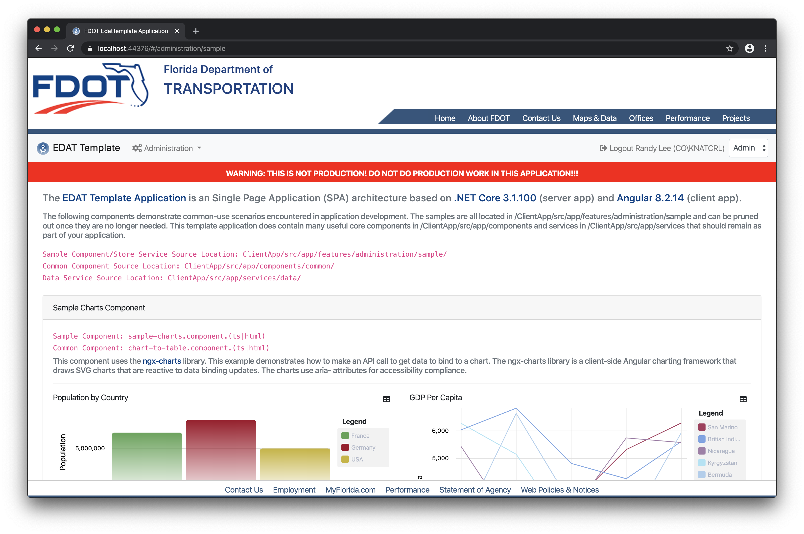

## Getting Started

### Install the Following Tools (in order)

The default installation is all that is needed for all of the required software below. No customization is necessary.

1. [Google Chrome](https://www.google.com/chrome/?brand=CHBD&gclid=Cj0KCQiA04XxBRD5ARIsAGFygj-zVcWMKlPkx_upUXkyUoH-DbhKUATruLe4oAP8_IS-uWWaPvo-v48aAuJEEALw_wcB&gclsrc=aw.ds) and (optionally) [Augury](https://augury.rangle.io/)
2. [Git for Windows](https://gitforwindows.org/) - latest version
3. [SQL Server Developer](https://www.microsoft.com/en-us/sql-server/sql-server-downloads) and [SQL Server Management Studio](https://docs.microsoft.com/en-us/sql/ssms/download-sql-server-management-studio-ssms?view=sql-server-2017) - latest versions **Please make sure you install the SQL Server Developer database engine.**
4. [.NET Core SDK](https://www.microsoft.com/net/download) - **Please make sure you install version 3.1.200**
5. [Azure Storage Emulator (standalone installer)](https://docs.microsoft.com/en-us/azure/storage/common/storage-use-emulator) and (optionally) [Azure Storage Explorer](https://azure.microsoft.com/en-us/features/storage-explorer/) - latest versions
6. [Node.js and NPM](https://nodejs.org/en/) - latest LTS version - **This is one install - NPM is part of Node**
7. [Angular CLI](https://cli.angular.io/) - currently using version 9.0.7 - **You can install this from a command terminal window (Windows Start -> type 'cmd') with the command `npm install -g @angular/cli`**
8. [VS Code](https://code.visualstudio.com/) - latest version

_Visual Studio 2019 is optional, but provides better server-side debugging. If you want to use Visual Studio, please make sure all updates are installed. VS Code is the recommended IDE for developing, but it can be slow when debugging .NET Core code. The ETA is configured for debugging in both VS Code (Node server) and Visual Studio (IIS development server), but they use the same port (44376). If you use Visual Studio for debugging, you will need to kill the IIS process before using the Node server again. Not doing so will result in an exception for the port already in use._

### Prerequisite Configuration

The **[ 1 TIME ]** notation will mark the sections or items that are only necessary the first time you create an ETA application and are not necessary to repeat each time you start a new application.

#### VS Code Configuration

There are several VS Code extensions and settings customizations that will make developing applications based on the ETA much easier.

##### Install Fira Code Font [ 1 TIME ]

Installing the [Fira Code Font](https://github.com/tonsky/FiraCode) is highly recommended. Once you follow the directions below to configure your VS Code, it will attempt to use this font first. While not required, this font is helpful in that it was developed specifically for coding. The problem statement from their website is: _"Programmers use a lot of symbols, often encoded with several characters. For the human brain, sequences like ->, <= or := are single logical tokens, even if they take two or three characters on the screen. Your eye spends a non-zero amount of energy to scan, parse and join multiple characters into a single logical one. Ideally, all programming languages should be designed with full-fledged Unicode symbols for operators, but that’s not the case yet."_

##### Install Settings Sync and Configure VS Code [ 1 TIME ]

In VS Code, click "Extensions" on the left menu and search the marketplace for "Settings Sync" and click "Install."

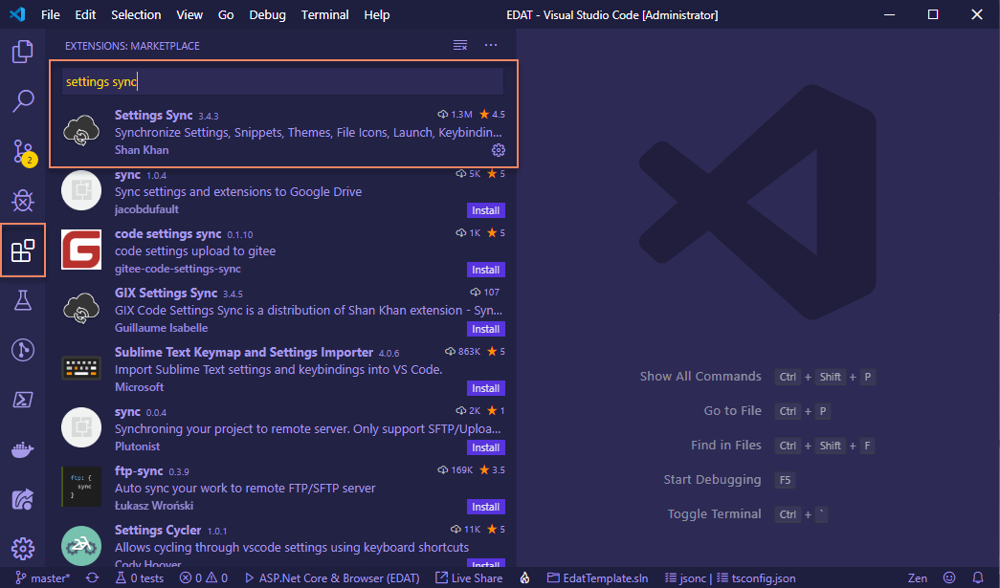

In VS Code, click the "Manage" gear button and select "Settings."

Under "Extensions" select "Code Settings Sync" and input the value `ec7e93219fa06fd07531262eb1ae9aa8` in the "Sync: Gist" textbox.

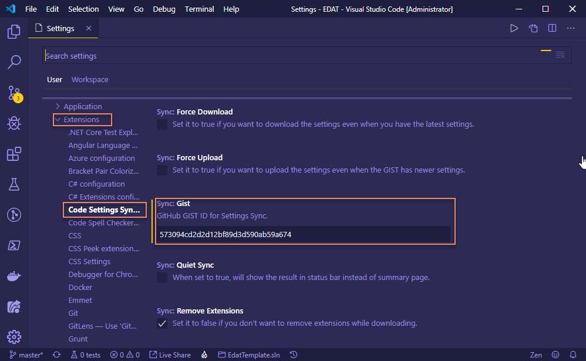

In VS Code, click the "Manage" gear button and select "Command Palette."

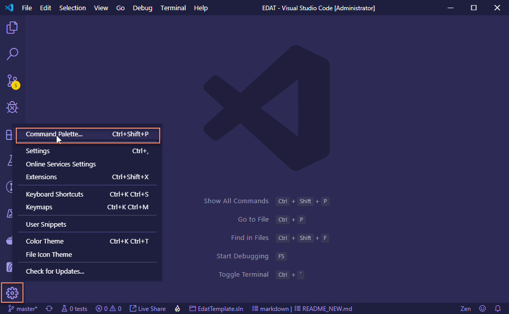

Type "sync" in the textbox and select `Sync: Advanced Options` then `Sync: Download Settings from Public GIST` then type "sync" in the textbox and select `Sync: Download Settings`.

This will begin the installation of several VS Code extensions and apply a specific configuration. Once the synchronization completes, please close and reopen VS Code. At this point, you can adjust VS Code to your own preferences for themes and settings. This configuration is just to get you started with a great set of required or helpful extensions and a good theme and configuration.

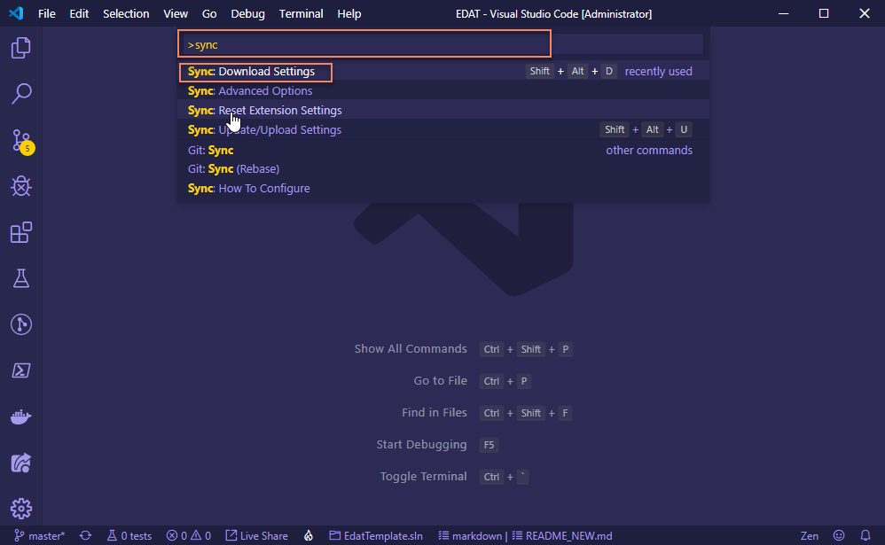

#### Request secrets.json [ 1 TIME ]

Contact Randy `randy.lee@dot.state.fl.us` to obtain the secrets.json file for the Azure Identity Providers and APIs. This is a JSON file that will be stored on the developers workstation and NEVER committed to Git (the ETA's gitignore file is already set to ignore it). This file must be distributed to each developer via FDOT's File Transfer Appliance (FTA) and not via email.

**Please go ahead and request the secrets.json file now even though you won't need them until a little later in the process.**

The secrets.json file contains keys for the following settings:

- `SendGridConfig:ClientSecret` - API key for the SendGrid Email Service
- `Security:OpenIdConnectB2EOptions:ClientSecret` - Key for Azure AD Authentication Provider
- `Security:OpenIdConnectB2COptions:ClientSecret` - Key for Azure B2C Authentication Provider
- `FdotCoreApisConfig:ClientSecret` - API key for the Arculus common services (Staff, OrgCodes, DotCodes)
- `EdmsApiConfig:Password` - Password for the EDMS service
- `EdmsApiConfig:ClientSecret` - API key for the EDMS service

As new services are added to the ETA in the future, it might be necessary to update the secrets.json. This documentation will be kept up to date, so if this documentation references secrets that you are missing on your workstation, you will need to request an updated set.

##### An explanation of User Secrets

Using the Azure platform requires access to services that provide things like identity management and authentication, SMTP (email), and FDOT enterprise data and resources. These services require an authorization key for each application. The ETA has been assigned keys for you to use during development. Once your application is ready to be deployed to Azure TEST, you will need to request keys that are unique to your application.

The [.NET Core CLI](https://docs.microsoft.com/en-us/dotnet/core/tools/?tabs=netcore2x) will be used to read the secrets.json file and store the keys on your workstation, but before you can do that, you must first pull the ETA source code to your workstation. This is because the user secrets are stored on your workstation with a GUID identifier specified in the .NET Core project file. Once you do this one time, you will not need to repeat this process unless the user secrets are updated or the GUID in the project file changes. So you will be able to continue developing applications with the same user secrets as long as the project files specify the same GUID identifier.

Go ahead and use the PowerShell installer to create a sandbox application from the ETA source and the instructions for setting the user secrets will follow after that.

### Start a New Application

#### Download the [PowerShell Clone Script](https://fdot.visualstudio.com/EDAT_Agile/_git/CloneTemplate)

A special _thank you!_ to Jim Quinn for creating the installer. If you have any issues, please contact Jim via email - `james.quinn@dot.state.fl.us`

Download the script from the Git repository.

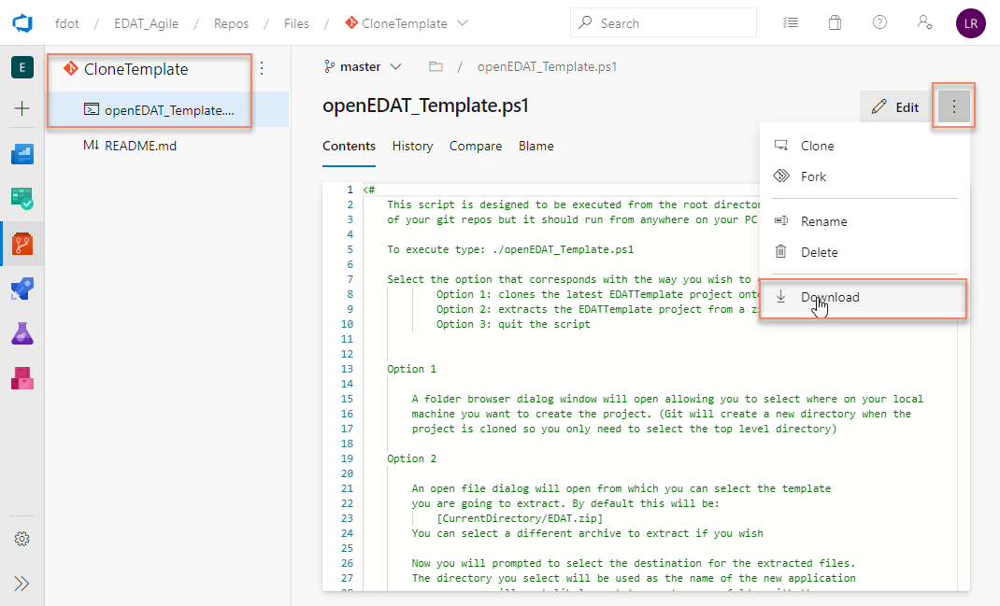

View the file properties and unblock the PowerShell script.

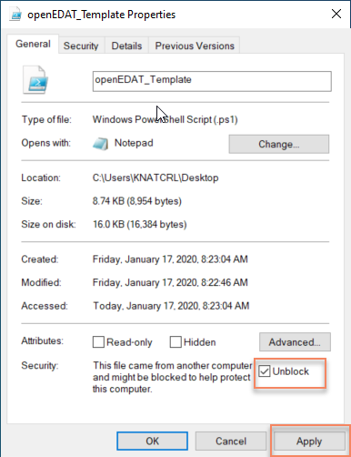

##### Create a New Application

The recommended approach for using the installer script is:

- Create a new empty folder on your workstation and place the script in it.
- Open PowerShell `Windows Start -> Type "PowerShell" -> Open`
- Change the directory to the new folder you just created - type `cd "C:\Users\KNABCXX\Desktop\New Folder"`and hit `Enter`
- Type `.\openEDAT_Template.ps1` and hit `Enter`
- Enter a new name for the project (typically a 3 character abbreviation) and hit `Enter`
- Wait for the script to complete. It will take several minutes for the script to clone the code from the Git repository, restore the NuGet packages, build the .NET Core project, install the npm packages, and build the Angular application.

Once the installer completes, you should see the results of the Angular build.

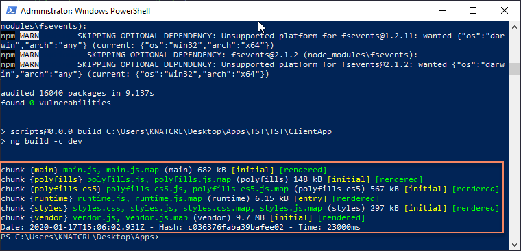

##### Open the New Application in VS Code

- In VS Code select `File -> Open Folder`
- Choose the folder that contains the solution file (XXX.sln)
- Your file explorer view in VS Code should look like the image below with `.sln` file and the `.vscode` folder. If this is not what you see, you might have opened the project folder (one level too deep). If this is the case, select `File -> Close Folder` and try again. **You should always open the folder at the solution level in VS Code. Not doing so will cause problems when you attempt to run or debug the application.**

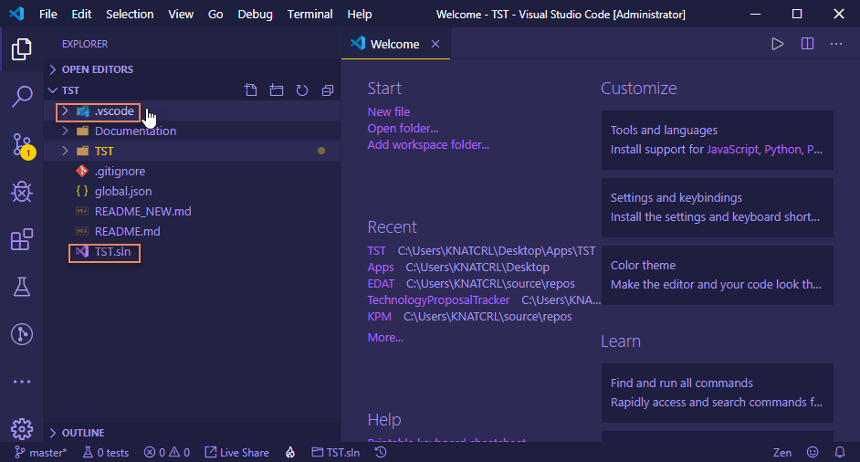

- Expand the project folder (it contains the `.csproj` file).
- Open the `appsettings.json` file for editing, and locate the `AzureStorageConfig.ContainerName` setting.
- Update the value so that it is all lower case and select `File -> Save`. Azure BLOB storage requires container names to be lower case. When you're done, it should look something like the image below.

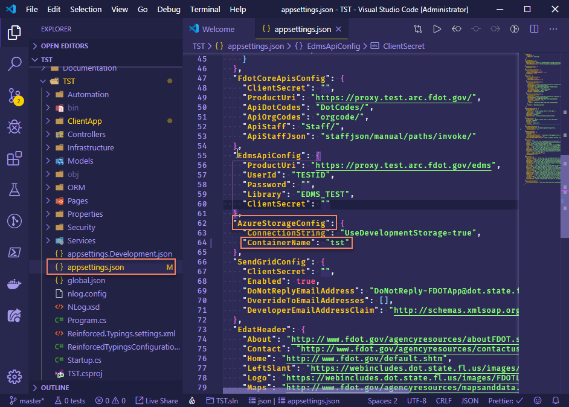

##### Set the User Secrets for the New Application [ 1 TIME ]

- Save the secrets.json file that you were sent via FTA to the project folder. The .gitignore file is already configured to ignore this file, but please verify (it will be dimmed as compared to the other files). The secrets.json file doesn't need to be added to the project, but it makes the next steps easier. See the image below.

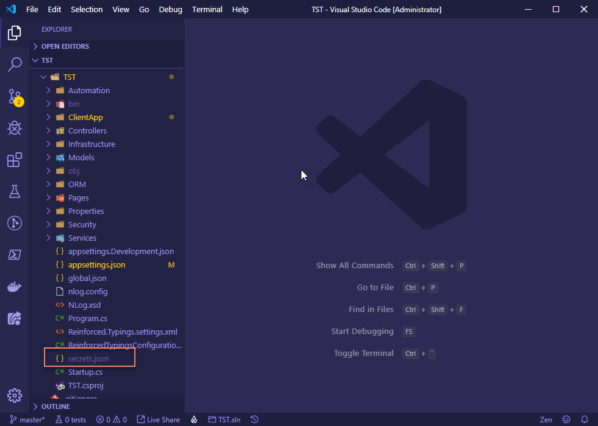

- Select `Terminal -> New Terminal` and make sure the terminal is set to `PowerShell`.
- Change the directory location to the project folder (`cd XXX`).
- Type the command `type ./secrets.json | dotnet user-secrets set` and hit `Enter`
- Verify the user secrets were successfully saved to the secret store with the command `dotnet user-secrets list`
- Once completed, your terminal window should look similar to the image below.

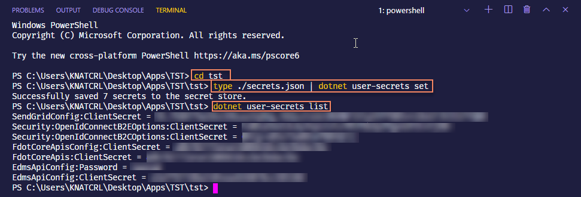

This will copy the secrets.json file to a folder in your profile's `AppData`

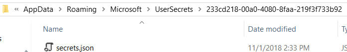

The .NET Core compiler will look for these secrets and combine them with the project's appsettings.json. The compiler looks for user secrets based on the GUID identifier in the project file.

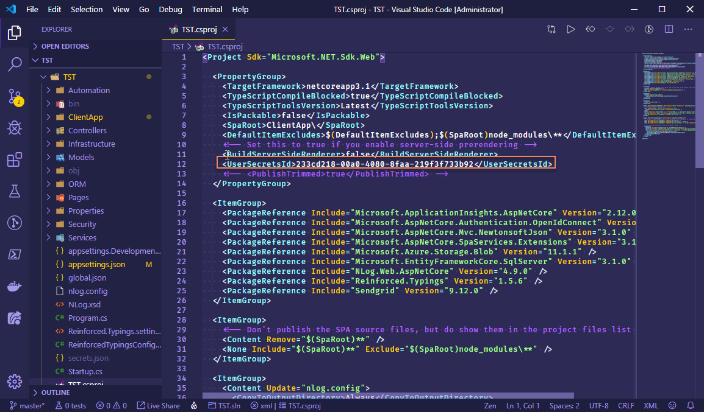

### Run the New Application

- Install a development certificate for HTTPS **[ 1 TIME ]**.
  - In the VS Code terminal, type `dotnet dev-certs https --clean` and hit `Enter`. You will need to confirm the certificate removal by clicking through a Window's dialog (or two).
  - In the VS Code terminal, type `dotnet dev-certs https --trust` and hit `Enter`. You will need to confirm the certificate install by clicking through a Window's dialog.
- Start the Azure Storage Emulator - `Windows Key`, type `Azure Storage Emulator` and hit `Enter`. You can exit the command window once the emulator is started, and it will continue to run in the background until you exit the process or restart your workstation.
- In VS Code select the `Debug and Run` menu option on the left, select `.NET Core Launch (web)` from the dropdown list, and hit `Start Debugging`
- The application should launch in the Google Chrome browser provided that you have the `Debugger for Chrome` extension installed. It might take a few minutes to startup because of all of the code compilation needed, so please be patient. When you're finished debugging, you should stop the VS Code debugger first, then exit the Chrome browser to avoid lag.
- If you see the following exception in VS Code `Microsoft.Data.SqlClient.SqlException ... Verify that the instance name is correct and that SQL Server is configured to allow remote connections,` the `ConnectionStrings.DbConnection` value in `appsettings.json` is invalid. The ETA uses a `.` (period) for the `Server` parameter value which indicates your local SQL Server instance. There can be scenarios where a fully-qualified server name (machine name) is required. Change the `Server=` to your machine name (e.g. `DOTPCO357001`) and try again. If this still doesn't work, you might have multiple local SQL Server instances and will need to specify the instance name as well as the server name.

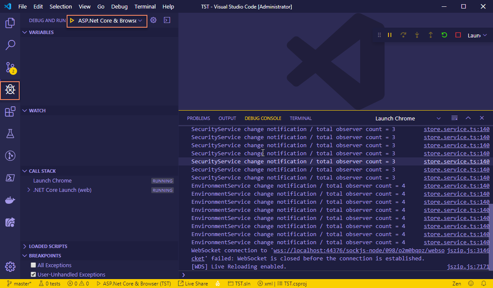

### Import the Source Code to Git

At this point, the source code can be added to Git. There are some housecleaning things you might want to do before, like:

- Delete the `Documentation` folder and to content of the README.md file. This is the file and assets you're reading right now. It does have relevant information about the architecture of your application, so you might want to keep it if you think it will help other team members working on your application. In either case, you should consider adding helpful information specific to your application to the README.md.
- Remove the sample code, if you would rather remove the code rather than just disabling it via appsettings.json.

The recommended approach to adding the source code to Git is:

- Go to `DevOps -> Repos` and create a new repository.
- Use Git Bash to clone the repository to your workstation.
- Copy the contents of the new application (.sln level folder) to the new local repository folder you just cloned.
- Delete the _old_ new application's folder created by the PowerShell script so you won't accidentally open it in VS Code :)
- Commit and Push the application source.

## ETA Architecture

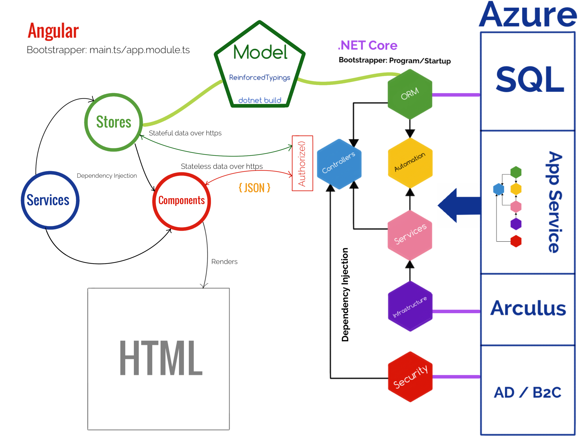

### General Overview

Think of development using ETA as creating two separate applications, a server application and a client application. The only aspect or information that is shared between the two is the model, and the only communication between the two is with client stores or controllers making requests to server API controllers (please see the _http_ service section to determine appropriate usage). The following is a detailed breakdown of the various tiers and components, and the responsibilities they have in the architecture.

### Model

The model can be thought of as "glue" code in that it represents the structure of information that is shared between the server and client applications and is what binds them together. The source code for the model resides in the .NET Core application _Model_ namespace, and the model classes are typically just _POCOs_ (plain old CLR/Core objects). The _Model_ namespace is further categorized by the scope namespaces of _Domain_, _Security_, and _View_. ETA uses the _Reinforced.Typings_ NuGet package to generate a TypeScript declaration file (\model.d.ts) that contains each model type during the MSBuild process. The _ReinforcedTypingsConfiguration.cs_ must be updated to add new model types to the code generation build step.

**A note about enums:** Enums need to be placed in a regular TypeScript file (\model.enums.ts) instead of a declaration file to be treated as constant values. There are other methods to achieve this, but this is the implementation used by ETA. The _ReinforcedTypingsConfiguration.cs_ is already configured to generate enums this way, but make sure you add enums in the _builder.ExportAsEnums()_ method.

**A note about ReinforcedTypings code generation failing to fire in the build process:** If _ReinforcedTypings_ stops generating the _Model_ types during the build, run `dotnet clean` in the .NET Core project. Then your _Model_ types should be generated on the next `dotnet build`.

#### Model - Domain

The _Domain_ namespace is where entities that represent the business domain are located. These are typically the _Entity Framework_ classes that represent the Azure SQL (or local SQL Server) database objects. Other business domain representations can also be defined here, like the _Staff_ entity which is the payload type for the _StaffService_ and not represented by a database table.

- **IAuditedEntity** The interface that entities that require last update audit fields should implement.
- **Staff** The object type returned by the _StaffService_.
- **AppUser** The abstract entity type that represents a known user in the application.
- **FdotAppUser** A super-class of AppUser that represents a user that authenticates with a FDOT AD account.
- **PublicAppUser** A super-class of AppUser that represents a user that authenticates with a FDOT B2C account.
- **{Your Entities}** Entities that represent the business domain of your application.

**A note about application state:** It is critically important that there is a single source of truth (or single representation of state) in the application. Having multiple representations of the same state is the primary cause of application bugs and unnecessary complexity. There are three tiers where state must be managed in a distributed application, the data store (Azure SQL), the application server (.NET Core application), and the client (Angular application). Since these are separate state representations, it is the developer's responsibility to have only a single representation of state in each tier and to manage their synchronization. The _Domain_ model is the representation of the state structure across all application tiers, and _Entity Framework_ is the framework used to keep the state synchronized between the data store and application server. We will discuss how state is managed in the client application later in the _Stores_ section.

#### Model - Edms

The Edms namespace is where types that represent the data structures necessary to interface with the FDOT's Enterprise Document Management System (EDMS) are defined.

- **EdmsDocument** Describes a document record in EDMS with the collection of versions available.
- **EdmsDocumentMetadata** Describes metadata about a document in EDMS. It contains information like the name, file size, document type, and a collection of user-defined properties.
- **EdmsDocumentProperty** Describes a user-defined property name-value pair for a document in EDMS.
- **EdmsDocumentType** Describes a grouping of documents in EDMS.
- **EdmsDocumentVersion** Describes a version (current or previous) of a document in EDMS.

#### Model - Security

The _Security_ namespace is where types that represent the security context and current principal of the application (to be shared with the client application) are located. These types include:

- **AuthProviderConfig** Describes the security context of the application such as whether role impersonation is allowed for development/testing and if the application supports Azure B2C authentication. This is a singleton type that is deserialized from _appsettings.json_.
- **ClientToken** Describes the current user and his roles so the client application understands what functions the user is authorized to perform. The _ClientToken_ is transported to the client application in plain text and is not tamper-proof, but this is okay. Its only purpose is to provide the information necessary for the client application to evaluate how it should render menu options and what routes should be available. All security checks will be performed in the server application's API controllers against the current principal that is deserialized from the encrypted authentication token obtained from Azure AD / B2C.

#### Model - View

The _View_ namespace is where types that represent transient state messages between client and server are located. These types include:

- **DocumentMetadata** Describes the information about a BLOB stored with the _StorageController_.
- **EdatFooter** Describes the image resources and links for the standard FDOT application footer. This is a singleton type that is deserialized from _appsettings.json_.
- **EdatHeader** Describes the image resources and links for the standard FDOT application header. This is a singleton type that is deserialized from _appsettings.json_.
- **EmailMessage** Describes the structure of an email message for use with the _EmailController_.
- **GraphData, GraphDataPoint, and GraphSeries** Represents data used for binding to _ngx charts_ and _chart-to-table_ components.
- **MapRequest** Describes the information about a GeoJSON record contained in BLOB storage.
- **SignatureRequest** Describes the information about a data-url encoded image for a signature record contained in BLOB storage.
- **StringRequest and StringResponse** Represents any string data payload between client and server.

### .NET Core Server Application

The .NET Core Server Application is responsible for handling requests from the client application, evaluating security concerns for those requests, validating that entity state changes adhere to business rules, synchronizing state changes with the data store, and managing access to Azure PaaS services. The server application uses _NuGet_ as the standard package management service.

#### Server - Bootstrapper

The _Program_ class handles pre-start host configuration and creates an instance of the _Startup_ class to configure application aspects like _Entity Framework_, _Open ID_ identity providers, and service dependency injection.

#### Server - Security

The _Security_ namespace is where constants for roles, claims, and authentication types, and the Azure identity provider configurations and event handlers are located. These types include:

- **ApplicationAuthenticationType, ApplicationClaims, and ApplicationsRoles** Constant value classes to ensure the integrity of security-related string keys used in the application.
- **B2COpenIdConnectEvents and B2EOpenIdConnectEvents** Event handlers for authentication success and failure conditions for the identity providers.
- **OpenIdConnectB2COptions, OpenIdConnectB2EOptions, and OpenIdConnectOptions** Describes the configuration to be used for the identity providers in startup. These are singleton types that are deserialized from _appsettings.json_.

#### Server - ORM

The _ORM_ namespace is where the _Entity Framework_ configuration, DbContext, and helpers are located.

- **ChangeTrackerExtensions** This class augments the normal _Entity Framework_ change tracking behavior by automatically setting last updated audit fields for any entity that implements the _IAuditedEntity_ interface.
- **EntityContext** This is the DbContext class that defines how our _Domain_ model entity types should be serialized to the data store.
- **EntityFrameworkConfig** Describes the runtime context for _Entity Framework_ such as whether to drop and create the database during development and if the SQL command logger should only log distinct commands. This is a singleton type that is deserialized from _appsettings.json_.
- **ModelBuilderExtensions** This class configures the _IAuditedEntity_ fields and associated database columns so that it is not necessary to decorate the properties on each entity that implements _IAuditedEntity_.
- **NLogSqlInterceptor** This is the logging class for _NLog_ that is used to generate a log of database commands with parameters and is formatted for execution in _SQL Server Management Studio_. This is the log that should be provided to your DBA for the SQL review.

**A note about repositories:** There are none. The primary purpose for the repository pattern is to hide the entity query and serialization details. This is typically necessary to accommodate good automated unit tests where repository mocks are used to test other business logic. _Entity Framework_ does not provide an abstraction of the DbContext or DbSet, but it does provide an "InMemory" database option with transactional scope to facilitate testing. This eliminates the need to mock repositories, so they are not used. If you prefer, you are welcome to use a repository pattern, but I find that it just adds an unnecessary tier to the application.

**A note about lazy loading:** Don't do it, it is an anti-pattern. While _Entity Framework_ supports lazy loading, ETA has it disabled by default. Always eager load the data you need for the request in the query.

#### Server - Infrastructure

The _Infrastructure_ namespace is where the services that communicate with other services external to the application are located. You should place services that interface with Azure PaaS services or other enterprise services here. These services should never be instantiated directly but should instead be coupled with an interface and dependency injected where needed. The goal here is to hide the implementation details as much as possible from the application since the application is not in control of potential changes to the external services.

- **AzureStorageConfig** Describes the connection details for the application's Azure Storage container. This is a singleton type that is deserialized from _appsettings.json_.
- **BlobStorageProvider** Service implementation for interfacing with Azure Storage.
- **EdmsApiConfig** Describes the EdmsService endpoints and client configuration for accessing the Arculus EDMS service. This is a singleton type that is deserialized from _appsettings.json_.
- **EdmsService** Service implementation for interfacing with the EDMS service on Arculus.
- **EmailService** Service implementation for interfacing with the SendGrid service on Azure.
- **FdotCoreApisConfig** Describes the Arculus service endpoints and client configuration for accessing the FDOT enterprise services. This is a singleton type that is deserialized from _appsettings.json_.
- **SendGridConfig** Describes the connection details for using the SendGrid service on Azure. This is a singleton type that is deserialized from _appsettings.json_.
- **StaffService** Service implementation for interfacing with the Staff service on Arculus. The _FdotCoreApisConfig_ configuration also defines endpoints for the _OrgCodes_ and _DotCodes_ services on Arculus, but you will need to implement your own application services if you need to use those. Only the _StaffService_ was implemented since it is so commonly used in applications.

#### Server - Services

The _Services_ namespace is where the interface contracts that describe the _Infrastructure_ service implementations are located.

- **IBlobStorageProvider** Interface for _Infrastructure BlobStorageProvider_.
- **IEdmsService** Interface for _Infrastructure EdmsService_.
- **IEmailService** Interface for _Infrastructure EmailService_.
- **ISignatureService** Interface for _Services SignatureService_.
- **IStaffService** Interface for _Infrastructure StaffService_.
- **SignatureService** Service for converting between data-url and binary image.

#### Server - Controllers

The _Controllers_ namespace contains the APIs for the endpoints exposed by the server application.

**Authorize()** Controllers have the sole responsibility for enforcing security concerns within the application. Make sure you use the _Authorize()_ attribute and evaluate the current principal's role appropriately to restrict access to API methods in your application!

- **Edms** API for creating, retrieving, and versioning documents in the FDOT's EDMS.
- **Email** API for sending an email via the _IEmailService_. You will need to make sure the _Authorize()_ attribute is applied appropriately for you application's usage. You will probably not use this controller if you just send emails from the server application (other controllers or business services). In that case, just inject the IEmailService and use it directly.
- **Map** API for saving and retrieving GeoJSON data stored in BLOB storage.
- **Security** API for retrieving a _ClientToken_ and impersonation (in development). Unlike the other controllers, the _Security_ controller also exposes some synchronous endpoints for redirecting to the _Open ID_ identity providers for authentication.
- **Signature** API for saving and retrieving data-url encoded signature images stored in BLOB storage.
- **Site** API for retrieving global site data like header and footer resources.
- **Staff** API for accessing the _IStaffService_.
- **Storage** API for accessing the _IBlobStorageProvider_. You will need to make sure the _Authorize()_ attribute is applied appropriately for you application's usage.
- **{Your Controllers}** APIs that you create for your application will manage the implementation of state changes to your entities. Again, please make sure you use the _Authorize()_ attribute appropriately to enforce security on your APIs. A good pattern for entity data validation is to validate any business rules that span over a set of entities within the controller. Validation rules that pertain only to the entity instance should be implemented within the entity itself using _DataAnnotations_ and the _IValidatableObject.Validate()_ method. Using this approach allows you to return a _BadRequest(ModelState) IActionResult_ and the client application's _http service_ will expose the list of validation errors to the client _store service_ which in turn can be handed off to the calling _component_ for processing.

#### Server - Automation

The _Automation_ namespace contains the hosted services needed by an application. Hosted services run in the background and are not context bound to an HTTP request. The purpose of hosted services is to perform some automated task needed by the application, and to repeat that task based on some time interval. Examples of this are cleaning up temporary BLOB storage every hour or auto-expiring permits beyond their expiration date daily. A lot of functions that traditionally have been implemented as separate batch jobs can probably fit nicely as a hosted service. In fact, it is best to think of hosted services as batch jobs that run inside the application. Because hosted services execute on threads not bound to an HTTP request, there is no notion of a current principal. However, hosted services can use injected dependencies like a DbContext for data access and other services.

- **AutomationConfig** Describes the configuration needed by hosted services. This is a singleton type that is deserialized from _appsettings.json_.
- **HostedService** The abstract base class that all custom hosted services should extend from. This class ensures the proper pattern is used for implementing the custom task the service is responsible for performing.

### Angular Client Application

The Angular Client Application is responsible for rendering the user interface of the application appropriately based on the user context and data state (workflow), handling all user interactions, managing the state of the application data in scope, and interfacing with the server application's APIs. The client application uses _NPM_ as the standard package management service.

#### Client - Bootstrapper

The _main.ts_ is the client entry point and bootstraps the _app.module_.

#### Client - app module

The _app.module_ imports the component declarations, other module imports (including _app-routing.module_), and service providers, and then bootstraps the entry component _app_. Any time you add a new component or service, it must be added to the _app.module_.

#### Client - app-routing module

The _app-routing.module_ is where all client application routes (URLs) are defined. Routes can optionally use the _route-guard_ with a _RouteData_ object to restrict access to specific roles. This is based on evaluating the _ClientToken_ and is not tamper-proof, but it serves the purpose of implementing a consistent UI workflow.

#### Client - Services

The _services_ folder is where all client services are located (except stores). Services are basically just JavaScript (TypeScript) objects that can be injected into components to provide some function. Try to adhere to a single-responsibility principle when designing your services. Also, it is important to understand how the Angular injector decides what scope a service has. This is especially important with any service that manages application state (i.e. stores). ETA only imports (provides) services in the _app.module_ which means all services are singletons and shared across all components. This is generally the service scope you want, but there may be cases when you want a component to have its own instance of a service.

##### data

- **blob** Provides access to the server's _Storage_ controller. This service does not maintain any state.
- **data-marshaler** Provides a means to pass string data from one component to another. This service maintains a string payload state.
- **data-navigation** Provides a means to sort, filter, and page through a data array. This service does not maintain any state.
- **edms** Provides access to the server's _Edms_ controller. This service does not maintain any state.
- **email** Provides access to the server's _Email_ controller. This service does not maintain any state. You will probably not use this service if you only need to send emails from the server application. In that case, just inject the IEmailService into the server controller or business service and use it directly.
- **excel-export** Provides a means to export a JSON data array to a Microsoft Excel file. This service does not maintain any state.
- **ngbMomentDatePickerAdapter** Extension service for the ng-bootstrap date picker component to use moment.js objects instead of the proprietary structure.
- **pdf-document** Provides a method to create a PDF document from an HTML template. This is just one example usage of the jsPDF library.
- **staff** Provides access to the server's _Staff_ controller. This service does not maintain any state.

##### environment

- **environment** Provides a means for the Angular router to compose URLs by specifying the application root path ('/' is the default). This service does not maintain any state.
- **loading** Provides a trigger for displaying a loading animation after a specified duration is exceeded on an asynchronous HTTP request.
- **toast** Provides a trigger for displaying toast messages.

##### http

The _http_ service is a wrapper around Angular's http service that has been extended to handle _ModelState_ error and unauthorized responses. This is the http service your components, services and stores should use. This service does not maintain any state.

**A note about the http service:** The http service should be injected into a component or service for use in calling the server application's APIs. There are two rules that should be followed to determine if the http service can be used directly in a component, or whether a service should be created to encapsulate the HTTP calls.

1. If the data is static to the client (data that doesn't need to be observed for changes on the client), using the http service in a component is allowed. If the data needs to be observed for changes on the client, a store service should be used to encapsulate the HTTP calls.
2. If the data is static to the client, but the same HTTP call is needed by multiple components (via service injection), a service should be used to encapsulate the HTTP calls.

##### security

- **route-guard** Used in a declarative manner in the _app-routing.module_ to restrict access to routes not authorized for the principal's _ClientToken_ roles. This service does not maintain any state.
- **security** Provides a means to access the principal's _ClientToken_ from the _Security_ controller. This service maintains the client application's state of the _ClientToken_ and is a observable store service.

#### Client - Stores

Store services that represent the state management of your application's data should be placed in the _features_ folder.

Store services are a special type of service that manages the state of some 'subject' and notifies all subscribers of any changes to that subject's state. This is how you will manage your model's state in the client application, and this is the most typical type of custom service you will implement. Your application model entities should always be managed by store services, and the same entity type should never be the subject of more than one store service (directly or indirectly). This is how we ensure a single source of truth in the client application.

Store services extend the _Store_ abstract class. This class implements two subscribe methods (_safeSubscribe_ and _safeSubscribeMap_) The subject can be any object, object graph, or array of objects. It is up to you to decide how you will compose your stores based on the model and workflow of your application. You may choose to have only one store for your entire application, or you may have one store for each logical area of your application.

**A note about store services:** Store services use the _RxJS_ library which is an integral part of Angular. The subject of a store services is a _BehaviorSubject_ type which is an Observable and Observer. Components that use store services should implement _OnInit_ and must implement _OnDestroy_. Typically, you will subscribe to the store service in the _ngOnInit()_ method to 'observe' the service's subject and provide a callback to handle state change notifications for that subject.

**A note about Observables and store services:** Observables come in two flavors; finite and infinite. Many Angular services (like Http and ActivatedRoute) return finite Observables in that Angular handles unsubscribing when the operation completes (i.e. an HTTP call finishes or a route is changed). All store services manage infinite Observables, meaning that the Observable represents some type of application state over a non-deterministic amount of time. These types of Observables must be unsubscribed from to avoid a memory leak in the client application. The abstract _Store_ class handles the unsubscribe for all services that extend from it. The _safeSubscribe(Map)_ methods protect the actual Observable and instead return only a representation of the current state (the value of the Observable) to the Observer callback in the component whenever the Observable state changes. So components never have access to the actual Observable. Your custom store services that extend from _Store_ do have access to the Observable and have the sole responsibility for mutating the Observable's state. If your store service manages an entire object graph (typical scenario) and you have components that only need to be notified of changes to a sub-set of the graph, you should subscribe with the _safeSubscribeMap_ method and pass a predicate to project only the state your component is interested in. Your component will only be notified of changes to state for objects in the projection. In other words, _safeSubscribeMap_ allows a component to subscribe to only a part of the Observable managed by your store service. The _safeSubscribe_ method always subscribes to the root Observable of the store service.

##### store

The store abstract class that all observable store services should extend from. This service provides access to an Observable for services that extend from it, and it provides a safe subscribe method for components to receive state change notifications about the Observable. The _Store_ service was based on the following pattern, but has been extended to provide better protection from memory leak risk... [State management in Angular with observable store services](https://jurebajt.com/state-management-in-angular-with-observable-store-services/)

#### Client - Components

The _components_ folder is where all client general use components are located. The components you build for your application will typically go in the _features_ folder. Components are basically just JavaScript (TypeScript) objects with an associated HTML template. It is up to you to decide how to compose your application's views with components, but generally you should try to keep components as small as possible for reusability. A component can be as small as a single button like the Template Application's _sort-button_ or can be more complex like the _file-upload_ component. Components are often composed of other components like the Template Application's _sample-data_ component. This component uses the _sort-button_, _filter-field_, and _sample-modal_ components. The _sample-modal_ component in turn uses the _staff-picker_ component. Any view within your application is typically composed of many components in what is referred to as the component tree. It is very important to begin to think of your application in terms of component composition views instead of 'page' views.

**A note about component state:** Components only manage their own state. This is typically just state that tracks user actions or state assigned from the evaluation of a store service's subject and is used to hide or show certain sections of the component's template. Component state is always transient whereas service state is always deliberately scoped (usually global).

##### app

The _app_ component is the main component of the client application and is the 'root' of the application's component tree. The most important aspect of this component is that it contains the Angular _router-outlet_ component which has the responsibility of injecting the component associated with the current route (URL) into the component tree. It also has a custom 'fast route' implementation that will re-route the user to the deep link URL they requested after authentication if that link is access restricted. This scenario is typical of a URL sent in an email that is restricted to a specific role or roles.

##### common

Common components are utility components that serve very specific technical purposes unrelated the business domain of the application.

- **chart-to-table** Switches the graphical SVG view of an ngx-charts chart to a tabular view of the bound data to meet accessibility requirements.
- **date-field** An alternate component to the _ng-Bootstrap_ datepicker. This component is a standard textbox with a date format mask that binds to a _momentjs_ object.
- **edms-file-upload** Provides file uploading capabilities (new document and new version) to the FDOT's EDMS.
- **field-validation-message** Provides a means to display an error message in the context of the field the error is related to.
- **file-upload** Provides a view for selecting and uploading files.
- **filter-field** Provides a view for entering string data to be applied as a filter to a property in an object array.
- **map-field** Provides a means to view, draw, search, and annotate GIS data on a map.
- **signature-field** Provides a means to display and capture a hand-drawn signature on a canvas.
- **sort-button** Provides a view for sorting data ascending or descending.
- **staff-picker** Provides a type-ahead select for FDOT staff (SRS).
- **toasts-container** Provides an area to display messages from the toast service.

##### footer

The _footer_ component renders the standard FDOT footer in an accessible and responsive format. This component does bend the rule about making a direct http call to the _Site_ controller, but this is mitigated by the fact that this is a one-time call for static data.

##### header

The _header_ component renders the standard FDOT header in an accessible and responsive format. This component does bend the rule about making a direct http call to the _Site_ controller, but this is mitigated by the fact that this is a one-time call for static data.

##### home

The _home_ component is the 'landing page' of your application. You will need to modify this component's template to provide the introduction and purpose of your application.

##### nav-menu

The _nav-menu_ component is the menu for your application. It already contains the 'home' link and authentication links for Azure AD and B2C. You will need to modify this component to reflect the navigation structure of your application. Also, you will usually need to evaluate the _ClientToken_ to hide or show menu items based on the current principal's role.

##### not-authorized

The _not-authorized_ component is where the _http_ service re-routes a user when they receive a 403 (unauthorized) response from a server application API call. This should not happen if you use the _route-guard_ for restricting route access to appropriate roles and the _security_ service to subscribe to the _ClientToken_ for evaluating whether or not a user is allowed to make the API call (in other words, don't render actions that the user is not authorized to perform).

##### server-error

The _server-error_ component's sole purpose is to render the detailed .NET Core error page in an iframe for debugging. This is a development-only component.

##### Client - features

The _features_ folder is where should place the components and store services that represent the business domain of your application. You should break up features by 'areas' that represent distinct sections or functionality within your application.

## Configuration Files

The configuration files described below control many aspects of the build and runtime of the ETA. Knowing what the settings represent and what options are available is very important.

### .NET Core global.json

_You will not need to alter this file unless you upgrade your application's .NET Core SDK target._

The only purpose of this file is to specify which SDK version to use for building the .NET Core application. Currently, the ETA is targeting the latest SDK version 3.1.200. The ETA is kept current with .NET Core versions.

### .NET Core appsettings.json

The `appsettings.json` file is the primary configuration source for the .NET Core application. The settings you'll work with for development and deployment are described below. You will typically keep the settings appropriate for a developer's workstation, and this is the configuration that you'll commit to Git. As part of the DevOps Release Pipeline configuration, many of the settings will be replaced with values for hosting the application as an Azure App Service.

- `ConnectionStrings`: Database connection strings configuration
  - `DbConnection`: SQL Server (or Azure SQL) connection string - use your local server for development and replace in the DevOps Release Configuration for deployment
  - `DockerDbConnection`: Docker container connection if you prefer a Docker SQL Server container instead of a local development DB - (Development Only)
- `AutomationConfig`: Configuration settings for hosted services
  - `RunTasks`: Boolean value for starting the hosted services or not - usually hosted services are not run during development unless you're testing them
- `EntityFrameworkConfig`: Configuration settings for EntityFrameworkCore
  - `InitializeDatabase`: Boolean value to drop and recreate the SQL Server database or not (Development Only)
  - `DeduplicateLoggedCommands`: Boolean value to only capture distinct commands in the SQL log or all commands (Development Only)
  - `UseDocker`: Boolean value to use a Docker container SQL Server or a local SQL Server (Development Only)
- `Security`: Azure AD and B2C configuration settings
  - `AuthProviderConfig`: General authentication settings
    - `AllowB2C`: Boolean value to enable B2C authentication or not
    - `AllowImpersonation`: Boolean value to enable role impersonation for Azure AD authenticated users (Development Only)
  - `OpenIdConnectB2COptions`: Azure B2C Open ID settings
    - `ClientSecret`: The application secret for authorizing the use of Azure B2C - value is read from dotnet user-secrets during development and set in the DevOps Release Configuration for deployment
    - `ClientId`: The identifier for the application registration - the ETA Client ID for development and set in the DevOps Release Configuration to your application's ID for deployment
  - `OpenIdConnectB2EOptions`: Azure AD Open ID settings
    - `ClientSecret`: The application secret for authorizing the use of Azure AD - value is read from dotnet user-secrets during development and set in the DevOps Release Configuration for deployment
    - `ClientId`: The identifier for the application registration - the ETA Client ID for development and set in the DevOps Release Configuration to your application's ID for deployment
    - `RemoveUnusedClaims`: Boolean to remove all security group claims from the user principal except for the claims that match the configured roles for your application
    - `Roles`: An array of role names and security group identifier values that represent the application roles for AD users in the application
      - `Admin (or whatever you decide to name the role)`: An array of security group identifiers for the named role in the application
      - `(Other Roles)`: Roles that represent access levels in your application
- `FdotCoreApisConfig`: Arculus common services configuration
  - `ClientSecret`: The application's API key for authorizing the use of Arculus via Azure API Management - value is read from dotnet user-secrets during development and set in the DevOps Release Configuration for deployment
  - `ProductUri`: The base URI for the service endpoints
  - `ApiDotCodes`: The service endpoint segment for the DOTCODES service
  - `ApiOrgCodes`: The service endpoint segment for the ORGCODES service
  - `ApiStaff`: The service endpoint segment for the STAFF (SRS) service
  - `ApiStaffJson`: The service endpoint segment for the STAFF (SRS) service as JSON - if you prefer to manage the caching of staff information yourself
- `EdmsApiConfig`: Arculus EDMS service configuration
  - `ProductUri`: The service endpoint for the EDMS service
  - `UserId`: The EDMS service account user - set in the DevOps Release Configuration for deployment
  - `Password`: The EDMS Service account password - value is read from dotnet user-secrets during development and set in the DevOps Release Configuration for deployment
  - `Library`: The EDMS library associated with the service account user
  - `ClientSecret`: The application's API key for authorizing the use of Arculus EDMS via Azure API Management - value is read from dotnet user-secrets during development and set in the DevOps Release Configuration for deployment
- `AzureStorageConfig`: Azure BLOB Storage configuration
  - `ConnectionString`: The connection string for the application's BLOB Storage container - the emulator connection string is used during development and set in the DevOps Release Configuration for deployment
  - `ContainerName`: The top container name for the application (must be a lowercase value)
- `SendGridConfig`: SendGrid service configuration for SMTP
  - `ClientSecret`: The application's API key for authorizing the use of the SendGrid service - value is read from dotnet user-secrets during development and set in the DevOps Release Configuration for deployment
  - `Enabled`: Boolean value to send emails or not - sometimes developers prefer not to send emails during development
  - `DoNotReplyEmailAddress`: The standard do-not-reply email address
  - `OverrideToEmailAddresses`: An array of email addresses to send emails to regardless of the email addresses specified in the application logic - this is used for testing emails in development and Azure pre-prod (UAT)
  - `DeveloperEmailAddressClaim`: The AD claim that contains the developer's email address - this email address will be used to send emails to regardless of the email addresses specified in the application logic when debugging
- `ApplicationInsights`: Application analytics and logging configuration
  - `InstrumentationKey`: The instrumentation key for the application - the ETA key is used during development and the value is replaced in the DevOps Release Configuration for deployment

### ClientApp angular.json

_You will not need to alter this file unless you need to include additional scripts in the output bundles or change the structure of the client application._

The `angular.json` file primarily describes how to assemble and build (transpile) the client application. Both development and production build configurations are included.

### ClientApp package.json

_You will not need to alter this file unless you need to add custom scripts to use with `npm`. However, this file will be automatically updated anytime you add, update, or remove `npm` packages._

The `package.json` file primarily defines the npm packages (JavaScript frameworks and libraries) that the application depends on. These dependencies are spilt into packages needed at runtime and packages needed only for development. The determination of which packages are needed at runtime (and therefore included in the build output) is actually governed by the the `import` declarations in the application's source code, not the `package.json`. However, you should still keep the separation clear in the `package.json`.

_The `package-lock.json` contains the full list of packages (with their dependencies) and the specific versions used by your application. The `npm install` command will use the `package-lock.json` file to pull your application's node modules first, but will defer to using the `package.json` file if the lock file doesn't exist._

## ETA Security Model

The `OpenIdConnectB2EOptions:Roles` setting (appsettings.json) is where you define the roles your application will use for network users. In the template application the `Admin` role will be assigned to any authenticated network user that belongs to any of the security groups listed in the array. You will need to use the Azure Portal to determine the Object IDs for the security groups you are using as your application roles.

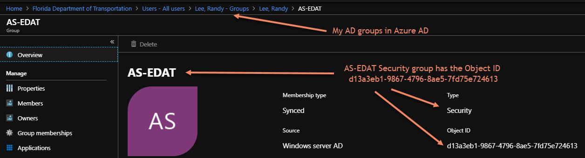

In `B2EOpenIdConnectEvents.cs` the principal's role claim will be assigned the admin role (i.e. `Admin`) if the user is a member of the AS-EDAT security group (i.e. `d13a3eb1-9867-4796-8ae5-7fd75e724613`).

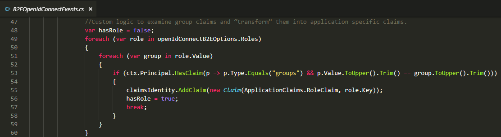

_IMPORTANT:_ You should use the standard `Authorize()` attribute to decorate your .NET API controllers/methods that are secured (access restricted). This is the primary security layer within the application.

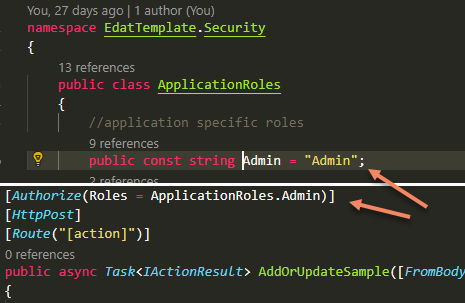

In the Angular `app-routing.module.ts` you should use the `RouteGuard` to restrict access to routes by user role. This is not a security aspect in that roles can be spoofed on the client browser by tech-savvy people, but it helps make the security intentions within the application clearer and helps prevent users from accessing routes that will result in an unauthorized (403) response code when an API call is made.

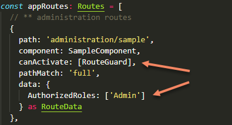

It is also the developer's responsibility to render only the application menu options that are accessible by the current user's role. This is handled by subscribing to the `SecurityService` (security.service.ts) in the `ngOnInit` lifecycle event of your component. See the example below from the `nav-menu.component.(ts|html)`.

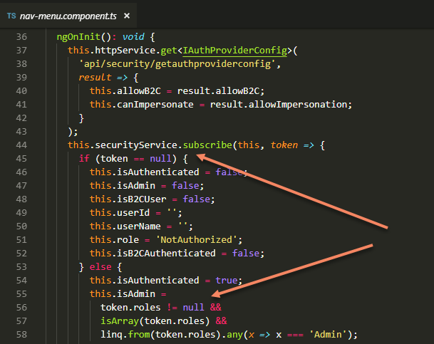

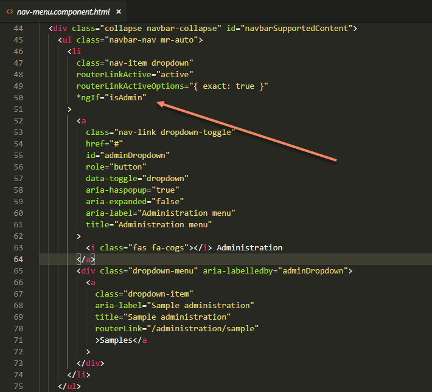

Role assignment for B2C users must be handled via a custom user/role management implementation in your application since these users are not in AD.

## Command Line Interface

These are the CLIs and the common commands you'll use to build, maintain, and configure your application.

### dotnet - .NET Core CLI

The following `dotnet` CLI commands must be executed in the `.sln` or `.csproj` containing directory.

- `dotnet clean` - Clean the .NET Core project's build output directories.
- `dotnet restore` - Restore (download) the NuGet packages in the .csproj file.
- `dotnet build` - Build the .NET Core project (and Angular client app) for debugging.
- `dotnet publish` - Build the .NET Core project (and Angular client app) with optimized bundles for deployment.

### npm - Node Package Manager

The following `npm` commands must be executed in the `package.json` containing directory.

- `npm install [package] (use --save-dev for a 'devDependency')` - Install a npm package for use in your application. If you omit the package name, npm will download (to `node_modules`) all missing packages for the dependencies in your `package.json` file.
- `npm uninstall [package]` - Remove a package.
- `npm run [script in package.json - typically 'build']` - Execute a named script defined in your `package.json` file. For example, if you want to build the client app, use `npm run build`. The 'build' script is defined in the `package.json` file, and simply executes the Angular build command `ng build -c dev`.
- `npm audit` - Audit your application's dependencies for reported vulnerabilities and provide direction for updating the packages to newer versions.

### ng - Angular CLI

The following `ng` commands must be executed in the `angular.json` containing directory.

- `ng update` - Audit and provide directions for updating Angular.
- `ng generate` - Template code generation for Angular types (i.e. component, service, module, and other types).
