# Table of Contents

1. [Introduction](#introduction)
   - [FAQ](#faq)
2. [Getting Started](#getting-started)
   - [Install the Tools](#install-the-following-tools)
   - [Prerequisite Configuration](#prerequisite-configuration---1-time-setup)
   - [PowerShell Installer](#powershell-installer)
   - [Run the Template Application](#run-template)
   - [Removing the Sample Code](#removing-the-sample-code)
3. [Manual New Application Steps](#manual-steps-to-create-a-new-application-from-the-template)
4. [Features](#features)
5. [Template Application Architecture](#template-application-architecture)
   - [Overview](#general-overview)
   - [Model](#model)
     - [Domain](#model---domain)
     - [Security](#model---security)
     - [View](#model---view)
   - [NET Core Server Application](#net-core-server-application)
   - [Bootstrapper](#server---bootstrapper)
     - [Security](#server---security)
     - [ORM](#server---orm)
     - [Infrastructure](#server---infrastructure)
     - [Services](#server---services)
     - [Controllers](#server---controllers)
   - [Angular Client Application](#angular-client-application)
     - [Bootstrapper](#client---bootstrapper)
     - [app module](#client---app-module)
     - [app-routing module](#client---app-routing-module)
     - [services](#client---services)
     - [components](#client---components)
     - [features](#client---features)
6. [Questions](#questions)

## Introduction

This is a template starter application with an Angular.io SPA front-end and .NET Core back-end.

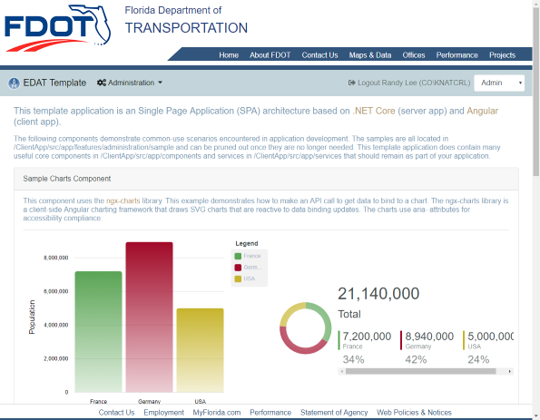

### FAQ

- Is this a low-code or no-code solution? - No. You must know how to code and be familiar with languages, frameworks and libraries like HTML, CSS, TypeScript, C# ASP.NET Core, Angular, Bootstrap, and Entity Framework Core.
- Is this a framework? - No. This is an application architecture that is composed of other frameworks to demonstrate specific patterns and techniques for quickly building business applications at the FDOT.
- Why have this template available? - We want to have a standard approach so that when we build applications we are doing it the same way. When somebody leaves and the new person comes in, we pick it up and understand what’s going on.
- When will we start implementing this solution/approach? - Immediately

## Getting Started

### Install the Following Tools

1. [.NET Core SDK](https://www.microsoft.com/net/download) - currently using .NET Core 3.1.100
2. [VS Code](https://code.visualstudio.com/)
3. [Azure Storage Emulator](https://docs.microsoft.com/en-us/azure/storage/common/storage-use-emulator) and [Azure Storage Explorer](https://azure.microsoft.com/en-us/features/storage-explorer/)
4. Node.js and NPM: [https://nodejs.org/en/](https://nodejs.org/en/)
5. SQL Server and [SQL Server Management Studio](https://docs.microsoft.com/en-us/sql/ssms/download-sql-server-management-studio-ssms?view=sql-server-2017)
6. Visual Studio 2019 (optional, but provides better server-side debugging) - make sure all updates are installed

### Prerequisite Configuration - 1 Time Setup

VS Code - Install the necessary extensions. The highlighted extensions are either required or highly recommended. The others are very useful.

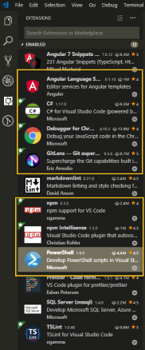

Public GIST ID for the Settings Sync extension: 573094cd2d2d12bf89d3d590ab59a674

VS Code or Command Terminal - Verify that you have the latest .NET Core SDK

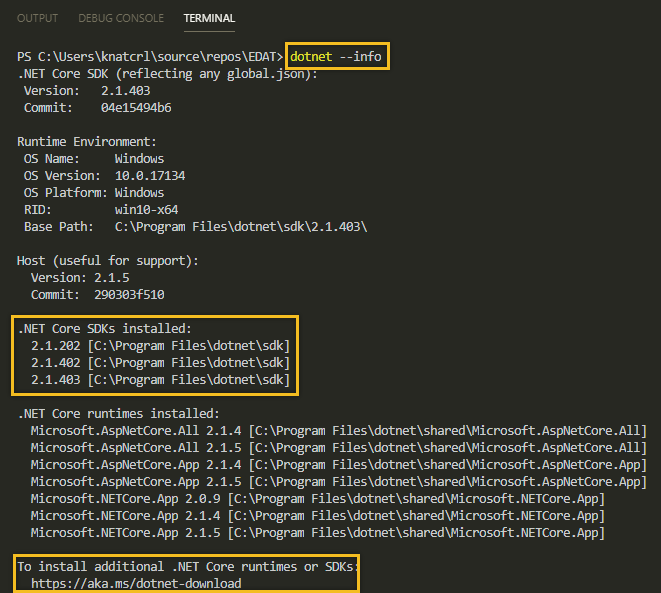

Contact Randy `randy.lee@dot.state.fl.us` to obtain the necessary client secrets for the Azure Identity Providers and APIs. This is a JSON file that will be stored on the developers workstation and NEVER committed to Git.

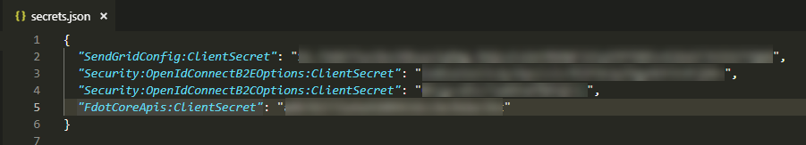

An explanation of user secrets... Using the Azure platform requires access to services that provide things like identity management and authentication, SMTP (email), and FDOT enterprise data. These services require a secret (password) for each application. The EDAT Template has been assigned secrets for you to use during development. Once your application is ready to be deployed to Azure TEST, you will need to request secrets that are specific to your application.

### PowerShell Installer

#### Download and Run the [PowerShell Script](https://fdot.visualstudio.com/EDAT_Agile/_git/CloneTemplate) to Create a New Application from the Template

A special _Thank you!_ to Jim Quinn. There are instructions for how to use the script in the repository **README**. If you have any issues, please contact Jim - `james.quinn@dot.state.fl.us`

You will need to unblock the PowerShell script before you execute it!

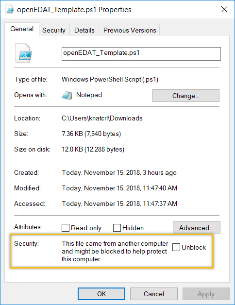

#### Warning

This will take several minutes to complete due to the NPM package installation.

Save the secrets.json file in the `{your-project-name}` project folder. The .gitignore file is already configured to ignore this file, but please verify. See the image below for the project structure. Notice that the `{your-project-name}` project is the .NET Core project and the `ClientApp` folder contains the Angular application.

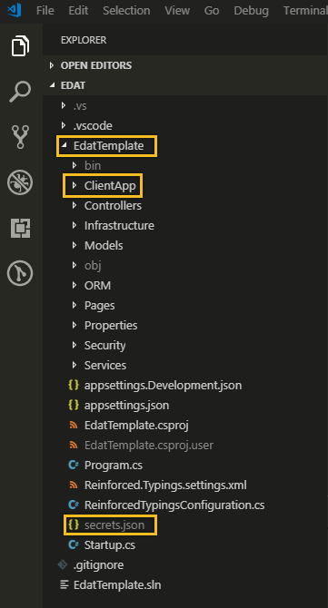

VS Code or Command Terminal - Use the `dotnet` CLI to set the user secrets.

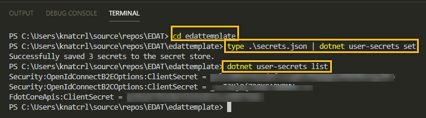

This will copy the secrets.json file to a folder in your profile's `AppData`

The .NET Core compiler will look for these secrets and combine them with the project's appsettings.json. The compiler looks for user secrets based on the key in the project file.

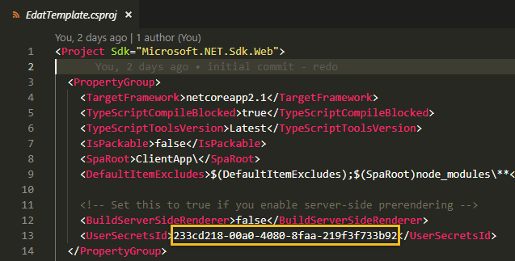

### Run Template

VS Code - In the Debug Menu (Ctrl + Shift + D), select `ASP.Net Core & Browser` and Hit Play! VS Code will automatically execute the `dotnet build` and `ng serve` commands and start Chrome. You can debug the .NET Core code by setting breakpoints in VS Code and debug the Angular application in Chrome developer tools.

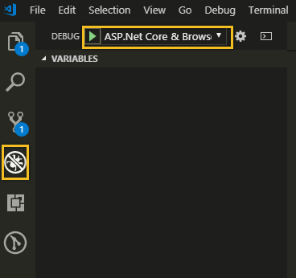

### Removing the Sample Code

At some point during development, or maybe even immediately after creating your application, you will probably want to remove the sample code. This can be done by following these steps:

1. Navigate to the project directory.
2. Delete the /Controllers/SampleController.cs file.
3. Delete the /Models/Domain/Sample.cs file.
4. Delete the /Models/Domain/Enums/StatusCode.cs file.
5. Build the .NET Core app (dotnet build) and fix the errors by removing references to the types in the deleted files.
6. Navigate to the project/ClientApp directory.
7. Delete the /src/app/features/administration/sample folder.
8. Remove the link to the Sample component in src/app/components/nav-menu.html.
9. Build the client app (npm run build) and fix the errors by removing the imports and routes in app.module.ts and app-routing.module.ts.
10. Delete the Documentation folder.
11. Delete or update the contents of the README.md file.

OPTIONAL: You may want to remove any of the core architecture features that your application doesn't require. For example, if you're not using Azure BLOB storage, you can remove the API controller, client storage service, file-upload.component, etc.

## Manual Steps to Create a New Application from the Template

1. Rename the extract folder to `{your-project-name}`
2. Rename the `EdatTemplate` folder to `{your-project-name}`
3. Rename the `EdatTemplate.sln` file to `{your-project-name}.sln`
4. Open the `{your-project-name}` folder
5. Rename the `EdatTemplate.csproj` file to `{your-project-name}.csproj`
6. VS Code - open the `{your-project-name}` folder
7. VS Code - Edit -> Replace in Files `EdatTemplate` with `{your-project-name]` and select "Replace All" (Ctrl + ALt + Enter)
8. VS Code (optional) - Set the `UserSecretsId` in the .NET Core project to a new value (usually a GUID) and reload new secrets for your new application. All applications deployed on Azure will require their own unique secrets, but developers can use the ones provided by Randy for local development.
9. VS Code - Hit Play! This will run these commands in order...
   - From `{your-project-name}` it runs `dotnet build` -> This restores NuGet packages, builds the .NET Core app, and generates the TypeScript model definition files (model.d.ts)
   - From `{your-project-name}\ClientApp` it runs `npm install` -> This creates the `node_modules` folder and installs the NPM packages defined in the `package.json` file.
   - From `{your-project-name}\ClientApp` it runs `ng serve` -> This builds the client app and starts the Angular-CLI server.
10. Images are served from the `{your-project-name}\ClientApp\dist\assets` folder. Running in VS Code will not create this folder since the Angular-CLI server serves files from in-memory. To get get the images for your application, run `npm run build` from inside the `{your-project-name}\ClientApp` folder at least once.

## Features

- Azure AD-B2C identity providers
- Unified client and server model. Synchronization handled with ReinforcedTypings on `dotnet build`
- Themed, 508 compliant, and responsive design (Bootstrap 4) for FDOT standards
- Role impersonation to assist with testing multiple application roles
- Components for header, footer, and navigation
- Service for async http request and response handling
- Security service and route guard
- Base service for subscription based (observable) services (data stores)
- Data navigation service with helper components to handle sorting, filtering, and paging through large data sets
- SRS (Staff) service and staff picker component to handle FDOT staff selections (with example)
- Complete CRUD example for client and server architecture patterns
- [Azure BLOB storage](https://azure.microsoft.com/en-us/services/storage/blobs/) service and component for document management (with example)
- [ngx-charts](https://swimlane.github.io/ngx-charts/#/ngx-charts/bar-vertical) library is included for charts and graphs

## Template Application Architecture

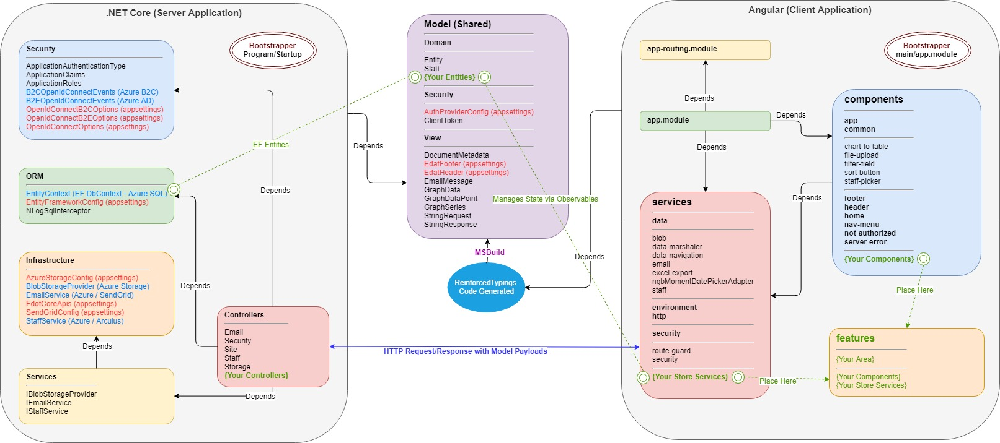

### General Overview

Think of development using the Template Application Architecture as creating two separate applications, a server application and a client application. The only aspect or information that is shared between the two is the model, and the only communication between the two is with client services or controllers making requests to server API controllers (please see the _http_ service section to determine appropriate usage). The following is a detailed breakdown of the various tiers and components, and the responsibilities they have in the architecture.

### Model

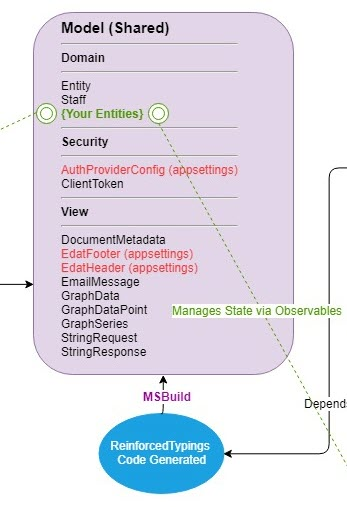

The model can be thought of as "glue" code in that it represents the structure of information that is shared between the server and client applications and is what binds them together. The source code for the model resides in the .NET Core application _Model_ namespace, and the model classes are typically just _POCOs_ (plain old CLR/Core objects). The _Model_ namespace is further categorized by the scope namespaces of _Domain_, _Security_, and _View_. The Template Application Architecture uses the _ReinforcedTypings_ NuGet package to generate a TypeScript declaration file (\model.d.ts) that contains each model type during the MSBuild process. The _ReinforcedTypingsConfiguration.cs_ must be updated to add new model types to the code generation build step.

**A note about enums:** Enums need to be placed in a regular TypeScript file (\model.enums.ts) instead of a declaration file to be treated as constant values. There are other methods to achieve this, but this is the implementation used by the Template Application Architecture. The _ReinforcedTypingsConfiguration.cs_ is already configured to generate enums this way, but make sure you add enums in the _builder.ExportAsEnums()_ method.

**A note about ReinforcedTypings code generation failing to fire in the build process:** If _ReinforcedTypings_ stops generating the _Model_ types during the build, run `dotnet clean` in the .NET Core project. Then your _Model_ types should be generated on the next `dotnet build`.

#### Model - Domain

The _Domain_ namespace is where entities that represent the business domain are located. These are typically the _Entity Framework_ classes that represent the Azure SQL (or local SQL Server) database objects. Other business domain representations can also be defined here, like the _Staff_ entity which is the payload type for the _StaffService_ and not represented by a database table.

- **IAuditedEntity** The interface that entities that require last update audit fields should implement.
- **Staff** The object type returned by the _StaffService_.
- **{Your Entities}** Entities that represent the business domain of your application.

**A note about application state:** It is critically important that there is a single source of truth (or single representation of state) in the application. Having multiple representations of the same state is the primary cause of application bugs and unnecessary complexity. There are three tiers where state must be managed in a distributed application, the data store (Azure SQL), the application server (NET Core application), and the client (Angular application). Since these are separate state representations, it is the developer's responsibility to have only a single representation of state in each tier and to manage their synchronization. The _Domain_ model is the representation of the state structure across all application tiers, and _Entity Framework_ is the framework used to keep the state synchronized between the data store and application server. We will discuss how state is managed in the client application later in the _service stores_ section.

#### Model - Security

The _Security_ namespace is where types that represent the security context and current principal of the application (to be shared with the client application) are located. These types include:

- **AuthProviderConfig** Describes the security context of the application such as whether role impersonation is allowed for development/testing and if the application supports Azure B2C authentication. This is a singleton type that is deserialized from _appsettings.json_.
- **ClientToken** Describes the current user and his roles so the client application understands what functions the user is authorized to perform. The _ClientToken_ is transported to the client application in plain text and is not tamper-proof, but this is okay. Its only purpose is to provide the information necessary for the client application to evaluate how it should render menu options and what routes should be available. All security checks will be performed in the server application's API controllers against the current principal that is deserialized from the encrypted authentication token obtained from Azure AD / B2C.

#### Model - View

The _View_ namespace is where types that represent transient state messages between client and server are located. These types include:

- **DocumentMetadata** Describes the information about a BLOB stored with the _StorageController_.
- **EdatFooter** Describes the image resources and links for the standard FDOT application footer. This is a singleton type that is deserialized from _appsettings.json_.
- **EdatHeader** Describes the image resources and links for the standard FDOT application header. This is a singleton type that is deserialized from _appsettings.json_.
- **EmailMessage** Describes the structure of an email message for use with the _EmailController_.
- **GraphData, GraphDataPoint, and GraphSeries** Represents data used for binding to _ngx charts_ and _chart-to-table_ components.
- **StringRequest and StringResponse** Represents any string data payload between client and server.

### NET Core Server Application

The .NET Core Server Application is responsible for handling requests from the client application, evaluating security concerns for those requests, validating that entity state changes adhere to business rules, synchronizing state changes with the data store, and managing access to Azure PaaS services. The server application uses _NuGet_ as the standard package management service.

#### Server - Bootstrapper

The _Program_ class handles pre-start host configuration and creates an instance of the _Startup_ class to configure application aspects like _Entity Framework_, _Open ID_ identity providers, and service dependency injection.

#### Server - Security

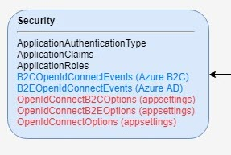

The _Security_ namespace is where constants for roles, claims, and authentication types, and the Azure identity provider configurations and event handlers are located. These types include:

- **ApplicationAuthenticationType, ApplicationClaims, and ApplicationsRoles** Constant value classes to ensure the integrity of security-related string keys used in the application.
- **B2COpenIdConnectEvents and B2EOpenIdConnectEvents** Event handlers for authentication success and failure conditions for the identity providers.
- **OpenIdConnectB2COptions, OpenIdConnectB2EOptions, and OpenIdConnectOptions** Describes the configuration to be used for the identity providers in startup. These are singleton types that are deserialized from _appsettings.json_.

#### Server - ORM

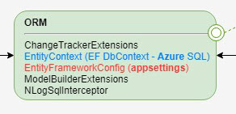

The _ORM_ namespace is where the _Entity Framework_ configuration, DbContext, and helpers are located.

- **ChangeTrackerExtensions** This class augments the normal _Entity Framework_ change tracking behavior by automatically setting last updated audit fields for any entity that implements the _IAuditedEntity_ interface.
- **EntityContext** This is the DbContext class that defines how our _Domain_ model entity types should be serialized to the data store.
- **EntityFrameworkConfig** Describes the runtime context for _Entity Framework_ such as whether to drop and create the database during development and if the SQL command logger should only log distinct commands. This is a singleton type that is deserialized from _appsettings.json_.
- **ModelBuilderExtensions** This class configures the _IAuditedEntity_ fields and associated database columns so that it is not necessary to decorate the properties on each entity that implements _IAuditedEntity_.
- **NLogSqlInterceptor** This is the logging class for _NLog_ that is used to generate a log of database commands with parameters and is formatted for execution in _SQL Server Management Studio_. This is the log that should be provided to your DBA for the SQL review.

**A note about repositories:** There are none. The primary purpose for the repository pattern is to hide the entity query and serialization details. This is typically necessary to accommodate good automated unit tests where repository mocks are used to test other business logic. _Entity Framework_ does not provide an abstraction of the DbContext or DbSet, but it does provide an "InMemory" database option with transactional scope to facilitate testing. This eliminates the need to mock repositories, so they are not used. If you prefer, you are welcome to use a repository pattern, but I find that it just adds an unnecessary tier to the application.

**A note about lazy loading:** Don't do it, it is an anti-pattern. While _Entity Framework_ supports lazy loading, the Template Application Architecture has it disabled by default. Always eager load the data you need for the request in the query.

#### Server - Infrastructure

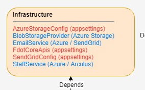

The _Infrastructure_ namespace is where the services that communicate with other services external to the application are located. You should place services that interface with Azure PaaS services or other enterprise services here. These services should never be instantiated directly but should instead be coupled with an interface and dependency injected where needed. The goal here is to hide the implementation details as much as possible from the application since the application is not in control of potential changes to the external services.

- **AzureStorageConfig** Describes the connection details for the application's Azure Storage container. This is a singleton type that is deserialized from _appsettings.json_.
- **BlobStorageProvider** Service implementation for interfacing with Azure Storage.
- **EmailService** Service implementation for interfacing with the SendGrid service on Azure.
- **FdotCoreApisConfig** Describes the Arculus service endpoints and client configuration for accessing the FDOT enterprise services. This is a singleton type that is deserialized from _appsettings.json_.
- **SendGridConfig** Describes the connection details for using the SendGrid service on Azure. This is a singleton type that is deserialized from _appsettings.json_.
- **StaffService** Service implementation for interfacing with the Staff service on Arculus. The _FdotCoreApisConfig_ configuration also defines endpoints for the _OrgCodes_ and _DotCodes_ services on Arculus, but you will need to implement your own application services if you need to use those. Only the _StaffService_ was implemented since it is so commonly used in applications.

#### Server - Services

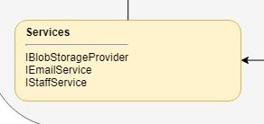

The _Services_ namespace is where the interface contracts that describe the _Infrastructure_ service implementations are located.

- **IBlobStorageProvider** Interface for _Infrastructure BlobStorageProvider_.
- **IEmailService** Interface for _Infrastructure EmailService_.
- **IStaffService** Interface for _Infrastructure StaffService_.

#### Server - Controllers

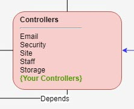

The _Controllers_ namespace contains the APIs for the endpoints exposed by the server application.

**FIREWALL** Controllers have the sole responsibility for enforcing security concerns within the application. Make sure you use the _Authorize()_ attribute and evaluate the current principal's role appropriately to restrict access to API methods in your application!

- **Email** API for sending an email via the _IEmailService_. You will need to make sure the _Authorize()_ attribute is applied appropriately for you application's usage. You will probably not use this controller if you just send emails from the server application (other controllers or business services). In that case, just inject the IEmailService and use it directly.
- **Security** API for retrieving a _ClientToken_ and impersonation (in development). Unlike the other controllers, the _Security_ controller also exposes some synchronous endpoints for redirecting to the _Open ID_ identity providers for authentication.
- **Site** API for retrieving global site data like header and footer resources.
- **Staff** API for accessing the _IStaffService_.
- **Storage** API for accessing the _IBlobStorageProvider_. You will need to make sure the _Authorize()_ attribute is applied appropriately for you application's usage.
- **{Your Controllers}** APIs that you create for your application will manage the implementation of state changes to your entities. Again, please make sure you use the _Authorize()_ attribute appropriately to enforce security on your APIs. A good pattern for entity data validation is to validate any business rules that span over a set of entities within the controller. Validation rules that pertain only to the entity instance should be implemented within the entity itself using _DataAnnotations_ and the _IValidatableObject.Validate()_ method. Using this approach allows you to return a _BadRequest(ModelState) IActionResult_ and the client application's _http service_ will expose the list of validation errors to the client _store service_ which in turn can be handed off to the calling _component_ for processing.

#### Server - Automation

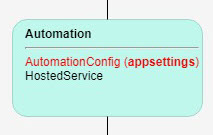

The _Automation_ namespace contains the hosted services needed by an application. Hosted services run in the background and are not context bound to an HTTP request. The purpose of hosted services is to perform some automated task needed by the application, and to repeat that task based on some time interval. Examples of this are cleaning up temporary BLOB storage every hour or auto-expiring permits beyond their expiration date daily. A lot of functions that traditionally have been implemented as separate batch jobs can probably fit nicely as a hosted service. In fact, it is best to think of hosted services as batch jobs that run inside the application. Because hosted services execute on threads not bound to an HTTP request, there is no notion of a current principal. However, hosted services can use injected dependencies like a DbContext for data access and other services.

- **AutomationConfig** Describes the configuration needed by hosted services. This is a singleton type that is deserialized from _appsettings.json_.
- **HostedService** The abstract base class that all custom hosted services should extend from. This class ensures the proper pattern is used for implementing the custom task the service is responsible for performing.

### Angular Client Application

The Angular Client Application is responsible for rendering the user interface of the application appropriately based on the user context and data state (workflow), handling all user interactions, managing the state of the application data in scope, and interfacing with the server application's APIs. The client application uses _NPM_ as the standard package management service.

#### Client - Bootstrapper

The _main.ts_ is the client entry point and bootstraps the _app.module_.

#### Client - app module

The _app.module_ imports the component declarations, other module imports (including _app-routing.module_), and service providers, and then bootstraps the entry component _app_. Any time you add a new component or service, it must be added to the _app.module_.

#### Client - app-routing module

The _app-routing.module_ is where all client application routes (URLs) are defined. Routes can optionally use the _route-guard_ with a _RouteData_ object to restrict access to specific roles. This is based on evaluating the _ClientToken_ and is not tamper-proof, but it serves the purpose of implementing a consistent UI workflow.

#### Client - services

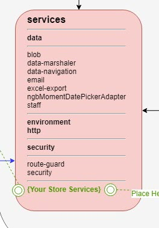

The _services_ folder is where all client services are located (except stores). Services are basically just JavaScript (TypeScript) objects that can be injected into components to provide some function. Try to adhere to a single-responsibility principle when designing your services. Also, it is important to understand how the Angular injector decides what scope a service has. This is especially important with any service that manages application state (i.e. stores). The Template Application Architecture only imports (provides) services in the _app.module_ which means all services are singletons and shared across all components. This is generally the service scope you want, but there may be cases when you want a component to have its own instance of a service.

##### data

- **blob** Provides access to the server's _Storage_ controller. This service does not maintain any state.
- **data-marshaler** Provides a means to pass string data from one component to another. This service maintains a string payload state.
- **data-navigation** Provides a means to sort, filter, and page through a data array. This service does not maintain any state.
- **email** Provides access to the server's _Email_ controller. This service does not maintain any state. You will probably not use this service if you only need to send emails from the server application. In that case, just inject the IEmailService into the server controller or business service and use it directly.
- **excel-export** Provides a means to export a JSON data array to a Microsoft Excel file. This service does not maintain any state.
- **ngbMomentDatePickerAdapter** Extension service for the ng-bootstrap date picker component to use moment.js objects instead of the proprietary structure.
- **staff** Provides access to the server's _Staff_ controller. This service does not maintain any state.

##### environment

The _environment_ service provides a means for the Angular router to compose URLs by specifying the application root path ('/' is the default). This service does not maintain any state.

##### http

The _http_ service is a wrapper around Angular's http service that has been extended to handle _ModelState_ error and unauthorized responses. This is the http service your components, services and stores should use. This service does not maintain any state.

**A note about the http service:** The http service should be injected into a component or service for use in calling the server application's APIs. There are two rules that should be followed to determine if the http service can be used directly in a component, or whether a service should be created to encapsulate the HTTP calls.

1. If the data is static to the client (data that doesn't need to be observed for changes on the client), using the http service in a component is allowed. If the data needs to be observed for changes on the client, a store service should be used to encapsulate the HTTP calls.
2. If the data is static to the client, but the same HTTP call is needed by multiple components (via service injection), a service should be used to encapsulate the HTTP calls.

##### security

- **route-guard** Used in a declarative manner in the _app-routing.module_ to restrict access to routes not authorized for the principal's _ClientToken_ roles. This service does not maintain any state.
- **security** Provides a means to access the principal's _ClientToken_ from the _Security_ controller. This service maintains the client application's state of the _ClientToken_ and is a observable store service.

##### store

- **store** Abstract class that all observable store services should extend from. This service provides access to an Observable for services that extend from it, and it provides a safe subscribe method for components to receive state change notifications about the Observable. The _Store_ service was based on the following pattern, but has been extended to provide better protection from memory leak risk... [State management in Angular with observable store services](https://jurebajt.com/state-management-in-angular-with-observable-store-services/)

##### {Your Store Services}

Your store services that represent the state management of your application's data should be placed in the _features_ folder.

Store services are a special type of service that manages the state of some 'subject' and notifies all subscribers of any changes to that subject's state. This is how you will manage your model's state in the client application, and this is the most typical type of custom service you will implement. Your application model entities should always be managed by store services, and the same entity type should never be the subject of more than one store service (directly or indirectly). This is how we ensure a single source of truth in the client application.

Store services extend the _Store_ abstract class. This class implements two subscribe methods (_safeSubscribe_ and _safeSubscribeMap_) The subject can be any object, object graph, or array of objects. It is up to you to decide how you will compose your stores based on the model and workflow of your application. You may choose to have only one store for your entire application, or you may have one store for each logical area of your application.

**A note about store services:** Store services use the _RxJS_ library which is an integral part of Angular. The subject of a store services is a _BehaviorSubject_ type which is an Observable and Observer. Components that use store services should implement _OnInit_ and must implement _OnDestroy_. Typically, you will subscribe to the store service in the _ngOnInit()_ method to 'observe' the service's subject and provide a callback to handle state change notifications for that subject.

**A note about Observables and store services:** Observables come in two flavors; finite and infinite. Many Angular services (like Http and ActivatedRoute) return finite Observables in that Angular handles unsubscribing when the operation completes (i.e. an HTTP call finishes or a route is changed). All store services manage infinite Observables, meaning that the Observable represents some type of application state over a non-deterministic amount of time. These types of Observables must be unsubscribed from to avoid a memory leak in the client application. The abstract _Store_ class handles the unsubscribe for all services that extend from it. The _safeSubscribe(Map)_ methods protect the actual Observable and instead return only a representation of the current state (the value of the Observable) to the Observer callback in the component whenever the Observable state changes. So components never have access to the actual Observable. Your custom store services that extend from _Store_ do have access to the Observable and have the sole responsibility for mutating the Observable's state. If your store service manages an entire object graph (typical scenario) and you have components that only need to be notified of changes to a sub-set of the graph, you should subscribe with the _safeSubscribeMap_ method and pass a predicate to project only the state your component is interested in. Your component will only be notified of changes to state for objects in the projection. In other words, _safeSubscribeMap_ allows a component to subscribe to only a part of the Observable managed by your store service. The _safeSubscribe_ method always subscribes to the root Observable of the store service.

#### Client - components

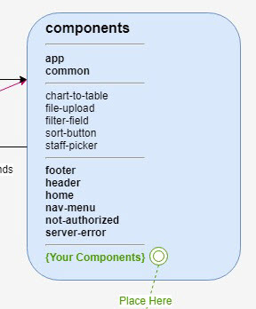

The _components_ folder is where all client general use components are located. The components you build for your application will typically go in the _features_ folder. Components are basically just JavaScript (TypeScript) objects with an associated HTML template. It is up to you to decide how to compose your application's views with components, but generally you should try to keep components as small as possible for reusability. A component can be as small as a single button like the Template Application's _sort-button_ or can be more complex like the _file-upload_ component. Components are often composed of other components like the Template Application's _sample-data_ component. This component uses the _sort-button_, _filter-field_, and _sample-modal_ components. The _sample-modal_ component in turn uses the _staff-picker_ component. Any view within your application is typically composed of many components in what is referred to as the component tree. It is very important to begin to think of your application in terms of component composition views instead of 'page' views.

**A note about component state:** Components only manage their own state. This is typically just state that tracks user actions or state assigned from the evaluation of a store service's subject and is used to hide or show certain sections of the component's template. Component state is always transient whereas service state is always deliberately scoped (usually global).

##### app

The _app_ component is the main component of the client application and is the 'root' of the application's component tree. The most important aspect of this component is that it contains the Angular _router-outlet_ component which has the responsibility of injecting the component associated with the current route (URL) into the component tree. It also has a custom 'fast route' implementation that will re-route the user to the deep link URL they requested after authentication if that link is access restricted. This scenario is typical of a URL sent in an email that is restricted to a specific role or roles.

##### common

Common components are utility components that serve very specific technical purposes unrelated the business domain of the application.

- **chart-to-table** Switches the graphical SVG view of an ngx-charts chart to a tabular view of the bound data to meet accessibility requirements.
- **date-field** An alternate component to the _ng-Bootstrap_ datepicker. This component is a standard textbox with a date format mask that binds to a _momentjs_ object.
- **file-upload** Provides a view for selecting and uploading files.
- **filter-field** Provides a view for entering string data to be applied as a filter to a property in an object array.
- **sort-button** Provides a view for sorting data ascending or descending.
- **staff-picker** Provides a type-ahead select for FDOT staff (SRS).

##### footer

The _footer_ component renders the standard FDOT footer in an accessible and responsive format. This component does bend the rule about making a direct http call to the _Site_ controller, but this is mitigated by the fact that this is a one-time call for static data.

##### header

The _header_ component renders the standard FDOT header in an accessible and responsive format. This component does bend the rule about making a direct http call to the _Site_ controller, but this is mitigated by the fact that this is a one-time call for static data.

##### home

The _home_ component is the 'landing page' of your application. You will need to modify this component's template to provide the introduction and purpose of your application.

##### nav-menu

The _nav-menu_ component is the menu for your application. It already contains the 'home' link and authentication links for Azure AD and B2C. You will need to modify this component to reflect the navigation structure of your application. Also, you will usually need to evaluate the _ClientToken_ to hide or show menu items based on the current principal's role.

##### not-authorized

The _not-authorized_ component is where the _http_ service re-routes a user when they receive a 403 (unauthorized) response from a server application API call. This should not happen if you use the _route-guard_ for restricting route access to appropriate roles and the _security_ service to subscribe to the _ClientToken_ for evaluating whether or not a user is allowed to make the API call (in other words, don't render actions that the user is not authorized to perform).

##### server-error

The _server-error_ component's sole purpose is to render the detailed .NET Core error page in an iframe for debugging. This is a development-only component.

##### {Your Components}

Your components that represent the functions and views of your application should be placed in the _features_ folder.

#### Client - features

The _features_ folder is where should place the components and store services that represent the business domain of your application. You should break up features by 'areas' that represent distinct sections or functionality within your application.

## Questions

_**What about Visual Studio? Can I still use it?**_

Yes. After the project is configured, you can choose to use Visual Studio as your IDE. Debugging in Visual Studio will use IIS Express as the development server, whereas debugging in VS Code will use the Angular CLI (Node) server.

_Caution: If you use both Visual Studio and VS Code, be aware that debugging in Visual Studio will result in IIS Express blocking port 44376 until you manually exit it in your system tray. If you leave IIS Express running and then try to debug in VS Code, you will get an error._

_**Where is the unit test project, and where are the client testing frameworks and configuration?**_

They have been removed in an effort to keep the code as simple and straight-forward as possible. Please feel free to add a .NET Core unit test project and add the Jasmine test framework back to Angular.

_**I am so sick of the template theme. How do I change it?**_

The EDAT Template supports [SASS styling](https://sass-lang.com/). the SASS files (.scss) are compiled to CSS as part of the build process. There are currently two built-in Bootstrap themes available, `office` (default) and `fdot`. You can change the theme in `{your-project-name}\ClientApp\src\styles\styles.scss`

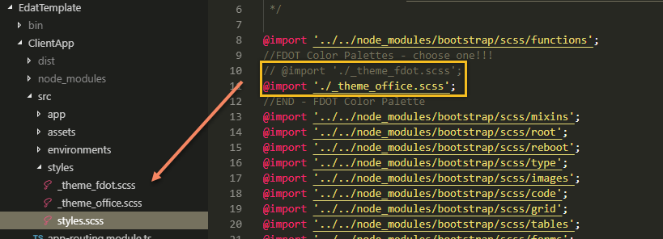

Commenting out the `_theme_office.scss` and uncommenting the `_theme_fdot.scss` changes the application theme to standard FDOT colors.

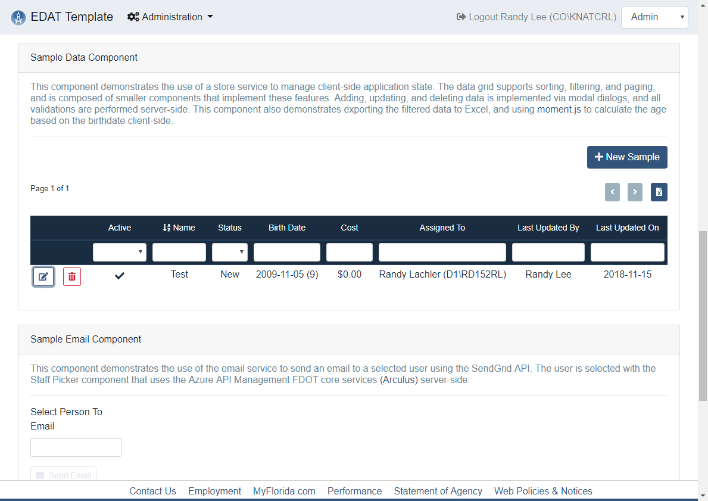

Please feel free to create your own themes, and please be sure to share with the rest of us. Currently, all themes must meet one of the approved [FDOT color palettes](http://www.fdot.gov/it/docs/standards/colorpalette-10252013.htm)

[Font Awesome](https://fontawesome.com/icons?d=gallery) is included in the template as our glyph library.

_**What do I need to know about the application configuration (appsettings.json) besides the user secrets already mentioned?**_

Here's a cheat-sheet of the more important settings and what their purpose is.

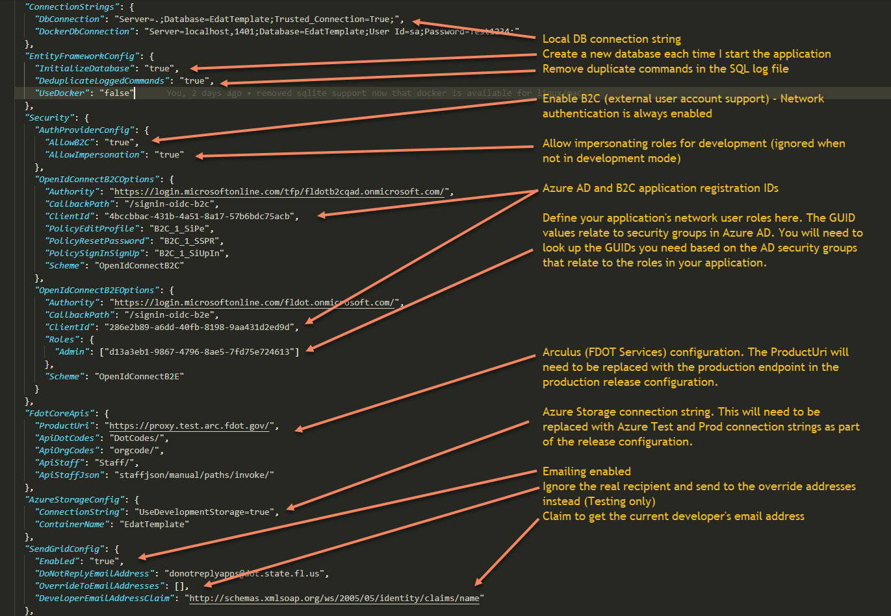

_**What do I need to know about the application's security model and how does it work?**_

The `OpenIdConnectB2EOptions:Roles` setting (appsettings.json) is where you define the roles your application will use for network users. In the template application the `Admin` role will be assigned to any authenticated network user that belongs to any of the security groups listed in the array. You will need to use the Azure Portal to determine the Object IDs for the security groups you are using as your application roles.

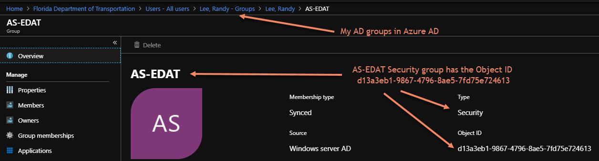

In `B2EOpenIdConnectEvents.cs` the principal's role claim will be assigned the admin role (i.e. `Admin`) if the user is a member of the AS-EDAT security group (i.e. `d13a3eb1-9867-4796-8ae5-7fd75e724613`).

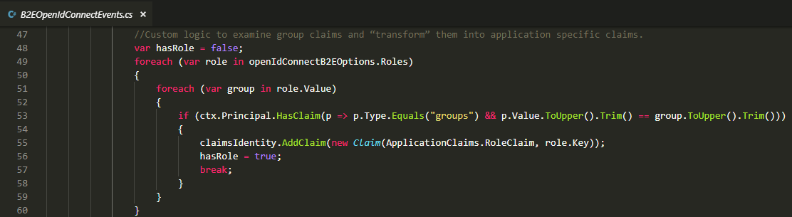

_IMPORTANT:_ You should use the standard `Authorize()` attribute to decorate your .NET API controllers/methods that are secured (access restricted). This is the primary security layer within the application.

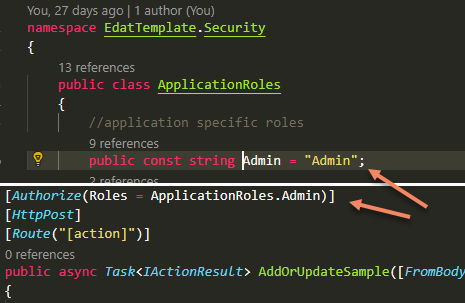

In the Angular `app-routing.module.ts` you should use the `RouteGuard` to restrict access to routes by user role. This is not a security aspect in that roles can be spoofed on the client browser by tech-savvy people, but it helps make the security intentions within the application clearer and helps prevents users from accessing routes that will result in an unauthorized (403) response code when an API call is made.

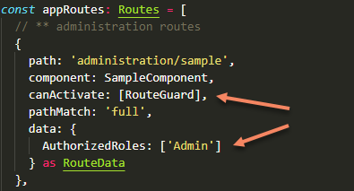

It is also the developer's responsibility to render only the application menu options that are accessible by the current user's role. This is handled by subscribing to the `SecurityService` (security.service.ts) in the `ngOnInit` lifecycle event of your component. See the example below from the `nav-menu.component.(ts|html)`.

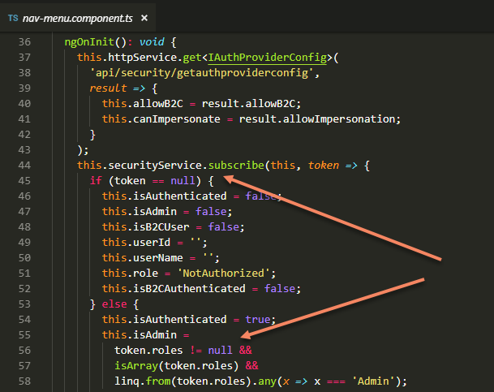

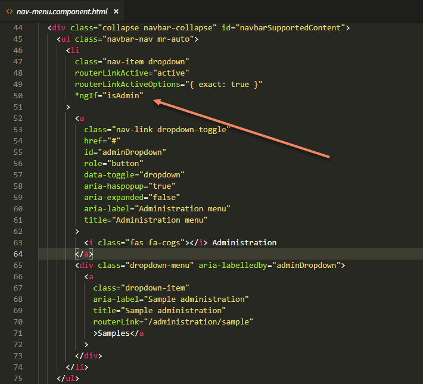

Role assignment for B2C users must be handled via a custom user/role management implementation in your application since these users are not in AD.

### Where We're Heading

- Full-stack Node.js architecture version (at some point, maybe...)
