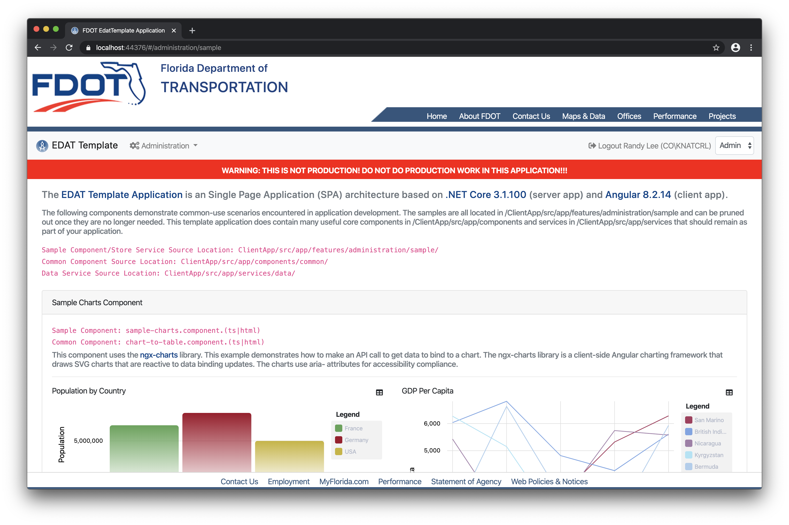

# Table of Contents

1. [Introduction](#introduction)
2. [Getting Started](#getting-started)
   - [Install the Tools](#install-the-following-tools)
   - [Prerequisite Configuration](#prerequisite-configuration---1-time-setup)
   - [PowerShell Installer](#powershell-installer)
   - [Run the Template Application](#run-template)
   - [Removing the Sample Code](#removing-the-sample-code)
3. [Manual New Application Steps](#manual-steps-to-create-a-new-application-from-the-template)

## Introduction

Welcome to the EDAT Template Application (ETA). The ETA is a Single Page Application (SPA) architecture developed with Angular and .NET Core. The ETA is not a framework, but it incorporates many open-source frameworks and software libraries into a robust architecure pattern for developing web applications for the FDOT. To use the ETA for developing an application, you will need to have experience with the core web languages HTML, CSS, and JavaScript (TypeScript). You will also need an understanding of specific software frameworks like .NET Core and Angular.

The ETA was developed for the specific purpose of standardizing the EDAT team's approach to building web applications. It contains several samples that demonstrate common coding techniques typically needed in the business applications we develop. These samples make use of reusable components and services that you can use in your application. These components and services are focused on leveraging Azure platform services (e.g. authentication and BLOB storage), and FDOT infrastructure (e.g. SRS, EDMS, GIS). Most of the components and services are plug-and-play and will not require any modification to use within your application.

The sample code has been isolated to a single folder in the client (Angular) application and a single API controller in the server (.NET Core) application. The sample code can (and should eventually be) removed from your application, but it is recommended to keep the samples intact until you no longer need them for reference. You can easily remove the sample menu item from the ETA by setting the "EdatHeader.ShowSamples" property to false in the appsettings.json file. Many aspects of the application's behavior is governed by appsettings.json. This will not remove the sample code, but it will remove the link to the samples in the application. With a few minor re-branding tasks like creating a logo and favicon.ico and adding some content to the landing page, and you're ready to start adding components and controllers for your application.

## Getting Started

### Install the Following Tools

1. [.NET Core SDK](https://www.microsoft.com/net/download) - currently using .NET Core 3.1.100
2. [VS Code](https://code.visualstudio.com/)
3. [Azure Storage Emulator](https://docs.microsoft.com/en-us/azure/storage/common/storage-use-emulator) and [Azure Storage Explorer](https://azure.microsoft.com/en-us/features/storage-explorer/)
4. Node.js and NPM: [https://nodejs.org/en/](https://nodejs.org/en/)
5. SQL Server and [SQL Server Management Studio](https://docs.microsoft.com/en-us/sql/ssms/download-sql-server-management-studio-ssms?view=sql-server-2017)
6. Visual Studio 2019 (optional, but provides better server-side debugging) - make sure all updates are installed

### Prerequisite Configuration - 1 Time Setup

VS Code - Install the necessary extensions. The highlighted extensions are either required or highly recommended. The others are very useful.

Public GIST ID for the Settings Sync extension: 573094cd2d2d12bf89d3d590ab59a674

VS Code or Command Terminal - Verify that you have the latest .NET Core SDK

Contact Randy `randy.lee@dot.state.fl.us` to obtain the necessary client secrets for the Azure Identity Providers and APIs. This is a JSON file that will be stored on the developers workstation and NEVER committed to Git.

An explanation of user secrets... Using the Azure platform requires access to services that provide things like identity management and authentication, SMTP (email), and FDOT enterprise data. These services require a secret (password) for each application. The EDAT Template has been assigned secrets for you to use during development. Once your application is ready to be deployed to Azure TEST, you will need to request secrets that are specific to your application.

### PowerShell Installer

#### Download and Run the [PowerShell Script](https://fdot.visualstudio.com/EDAT_Agile/_git/CloneTemplate) to Create a New Application from the Template

A special _Thank you!_ to Jim Quinn. There are instructions for how to use the script in the repository **README**. If you have any issues, please contact Jim - `james.quinn@dot.state.fl.us`

You will need to unblock the PowerShell script before you execute it!

#### Warning

This will take several minutes to complete due to the NPM package installation.

Save the secrets.json file in the `{your-project-name}` project folder. The .gitignore file is already configured to ignore this file, but please verify. See the image below for the project structure. Notice that the `{your-project-name}` project is the .NET Core project and the `ClientApp` folder contains the Angular application.

VS Code or Command Terminal - Use the `dotnet` CLI to set the user secrets.

This will copy the secrets.json file to a folder in your profile's `AppData`

The .NET Core compiler will look for these secrets and combine them with the project's appsettings.json. The compiler looks for user secrets based on the key in the project file.

### Run Template

VS Code - In the Debug Menu (Ctrl + Shift + D), select `ASP.Net Core & Browser` and Hit Play! VS Code will automatically execute the `dotnet build` and `ng serve` commands and start Chrome. You can debug the .NET Core code by setting breakpoints in VS Code and debug the Angular application in Chrome developer tools.

### Removing the Sample Code

At some point during development, or maybe even immediately after creating your application, you will probably want to remove the sample code. This can be done by following these steps:

1. Navigate to the project directory.
2. Delete the /Controllers/SampleController.cs file.
3. Delete the /Models/Domain/Sample.cs file.
4. Delete the /Models/Domain/Enums/StatusCode.cs file.
5. Build the .NET Core app (dotnet build) and fix the errors by removing references to the types in the deleted files.
6. Navigate to the project/ClientApp directory.
7. Delete the /src/app/features/administration/sample folder.
8. Remove the link to the Sample component in src/app/components/nav-menu.html.
9. Build the client app (npm run build) and fix the errors by removing the imports and routes in app.module.ts and app-routing.module.ts.
10. Delete the Documentation folder.
11. Delete or update the contents of the README.md file.

OPTIONAL: You may want to remove any of the core architecture features that your application doesn't require. For example, if you're not using Azure BLOB storage, you can remove the API controller, client storage service, file-upload.component, etc.

## Manual Steps to Create a New Application from the Template

1. Rename the extract folder to `{your-project-name}`
2. Rename the `EdatTemplate` folder to `{your-project-name}`
3. Rename the `EdatTemplate.sln` file to `{your-project-name}.sln`
4. Open the `{your-project-name}` folder
5. Rename the `EdatTemplate.csproj` file to `{your-project-name}.csproj`
6. VS Code - open the `{your-project-name}` folder
7. VS Code - Edit -> Replace in Files `EdatTemplate` with `{your-project-name]` and select "Replace All" (Ctrl + ALt + Enter)
8. VS Code (optional) - Set the `UserSecretsId` in the .NET Core project to a new value (usually a GUID) and reload new secrets for your new application. All applications deployed on Azure will require their own unique secrets, but developers can use the ones provided by Randy for local development.
9. VS Code - Hit Play! This will run these commands in order...
   - From `{your-project-name}` it runs `dotnet build` -> This restores NuGet packages, builds the .NET Core app, and generates the TypeScript model definition files (model.d.ts)
   - From `{your-project-name}\ClientApp` it runs `npm install` -> This creates the `node_modules` folder and installs the NPM packages defined in the `package.json` file.
   - From `{your-project-name}\ClientApp` it runs `ng serve` -> This builds the client app and starts the Angular-CLI server.
10. Images are served from the `{your-project-name}\ClientApp\dist\assets` folder. Running in VS Code will not create this folder since the Angular-CLI server serves files from in-memory. To get get the images for your application, run `npm run build` from inside the `{your-project-name}\ClientApp` folder at least once.
