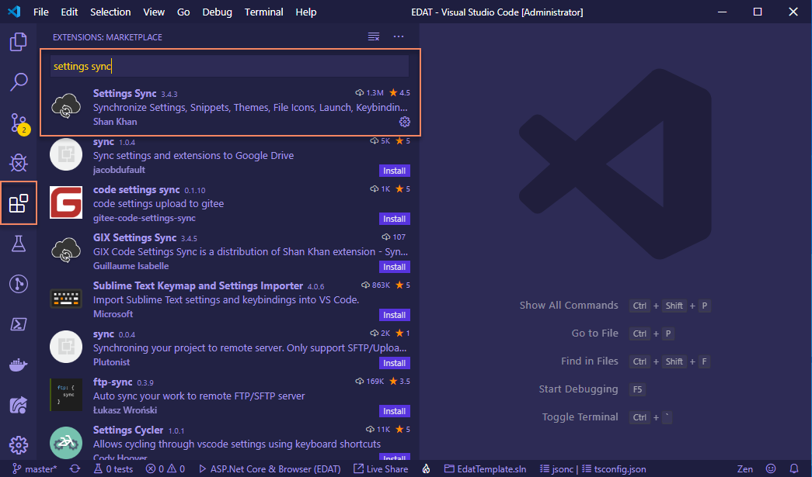

# Table of Contents

1. [Introduction](#introduction)
2. [Getting Started](#getting-started)
   - [Install the Tools](<#install-the-following-tools-(in-order)>)
   - [Prerequisite Configuration](#prerequisite-configuration---1-time-setup)
     - [VS Code](#VS-Code)
     - [.NET Core User Secrets](#.NET-Core-User-Secrets)
   - [PowerShell Installer](#powershell-installer)
   - [Run the Template Application](#run-the-template)

## Introduction

Welcome to the EDAT Template Application (ETA). The ETA is a Single Page Application (SPA) architecture developed with Angular and .NET Core. The ETA is not a framework, but it incorporates many open-source frameworks and software libraries into a robust architecure pattern for developing web applications for the FDOT. To use the ETA for developing an application, you will need to have experience with the core web languages HTML, CSS, and JavaScript (TypeScript). You will also need an understanding of specific software frameworks like .NET Core and Angular. The ETA, being a SPA, should be thought of as 2 separate applications (a client Angular application and a server .NET Core application). The client application source code is contained within the "ClientApp" folder located in the .NET Core server application project folder.

The ETA was developed for the specific purpose of standardizing the EDAT team's approach to building web applications. It contains several samples that demonstrate common coding techniques typically needed in the business applications we develop. These samples make use of reusable components and services that you can use in your application. These components and services are focused on leveraging Azure platform services (e.g. authentication and BLOB storage), and FDOT infrastructure (e.g. SRS, EDMS, GIS). Most of the components and services are plug-and-play and will not require any code modification to use within your application.

The sample code has been isolated to a single folder in the client (Angular) application and a single API controller in the server (.NET Core) application. The sample code can (and should eventually be) removed from your application, but it is recommended to keep the samples intact until you no longer need them for reference. You can easily remove the sample menu item from the ETA by setting the "EdatHeader.ShowSamples" property to false in the appsettings.json file. Many aspects of the application's behavior is governed by appsettings.json. This will not remove the sample code, but it will remove the link to the samples in the application. With a few minor re-branding tasks like creating a logo and favicon.ico and adding some content to the landing page, and you're ready to start adding components and controllers for your application.

## Getting Started

### Install the Following Tools (in order)

1. [SQL Server Developer](https://www.microsoft.com/en-us/sql-server/sql-server-downloads) and [SQL Server Management Studio](https://docs.microsoft.com/en-us/sql/ssms/download-sql-server-management-studio-ssms?view=sql-server-2017) - latest versions
2. [.NET Core SDK](https://www.microsoft.com/net/download) - currently using .NET Core 3.1.100
3. [Azure Storage Emulator](https://docs.microsoft.com/en-us/azure/storage/common/storage-use-emulator) and (optionally) [Azure Storage Explorer](https://azure.microsoft.com/en-us/features/storage-explorer/) - latest versions
4. [Node.js and NPM](https://nodejs.org/en/) - latest LTS version
5. [Angular CLI](https://cli.angular.io/) - currently using version 8.2.14
6. [VS Code](https://code.visualstudio.com/) - latest version

_Visual Studio 2019 is optional, but provides better server-side debugging. If you want to use Visual Studio, please make sure all updates are installed. VS Code is the recommended IDE for developing, but it can be slow when debugging .NET Core code. The ETA is configured for debugging in both VS Code (Node server) and Visual Studio (IIS development server), but they use the same port (44376). If you use Visual Studio for debugging, you will need to kill the IIS process before using the Node server again. Not doing so will result in an exception for the port already in use._

### Prerequisite Configuration - 1 Time Setup

#### VS Code

There are several VS Code extensions and settings customizations that will make developing applications based on the ETA much easier.

##### Fira Code Font

Installing the [Fira Code Font](https://github.com/tonsky/FiraCode) is highly recommended. Once you follow the directions below to configure your VS Code, it will attempt to use this font first. While not required, this font is helpful in that it was developed specifically for coding. The problem statement from their website is: _"Programmers use a lot of symbols, often encoded with several characters. For the human brain, sequences like ->, <= or := are single logical tokens, even if they take two or three characters on the screen. Your eye spends a non-zero amount of energy to scan, parse and join multiple characters into a single logical one. Ideally, all programming languages should be designed with full-fledged Unicode symbols for operators, but that’s not the case yet."_

##### Settings Sync

In VS Code, click "Extensions" on the left menu and search the marketplace for "Settings Sync" and click "Install."

In VS Code, click the "Manage" gear button and select "Settings."

Under "Extensions" select "Code Settings Sync" and input the value `573094cd2d2d12bf89d3d590ab59a674` in the "Sync: Gist" textbox.

In VS Code, click the "Manage" gear button and select "Command Palette."

Type "sync" in the textbox and select `Sync: Download Settings`. This will begin the installation of several VS Code extensions and apply a specific configuration. Once the synchronization completes, please close and reopen VS Code. At this point, you can adjust VS Code to your own preferences for themes and settings. This configuration is just to get you started with a great set of necessary extensions and a good theme and configuration.

#### .NET Core User Secrets

Contact Randy `randy.lee@dot.state.fl.us` to obtain the secrets.json file for the Azure Identity Providers and APIs. This is a JSON file that will be stored on the developers workstation and NEVER committed to Git (the ETA's gitignore file is already set to ignore it). This file must be distributed to each developer via FDOT's File Transfer Appliance (FTA) and not via email.

The secrets.json file contains keys for the following settings:

- `SendGridConfig:ClientSecret` - API key for SendGrid Email Service
- `Security:OpenIdConnectB2EOptions:ClientSecret` - Key for Azure AD Authentication Provider
- `Security:OpenIdConnectB2COptions:ClientSecret` - Key for Azure B2C Authentication Provider
- `FdotCoreApisConfig:ClientSecret` - API key for Arculus common services (Staff, OrgCodes, DotCodes)
- `EdmsApiConfig:Password` - EDMS password for EDMS service
- `EdmsApiConfig:ClientSecret` - API key for EDMS service

##### An explanation of User Secrets

Using the Azure platform requires access to services that provide things like identity management and authentication, SMTP (email), and FDOT enterprise data. These services require a secret (password) for each application. The EDAT Template has been assigned secrets for you to use during development. Once your application is ready to be deployed to Azure TEST, you will need to request secrets that are specific to your application.

These secrets will be read from the secrets.json file and stored on your workstation. The .csproj file contains a GUID key that enables the .NET Core compiler to find the secrets associated to your project, and the .NET Core build process will add the secrets to your project's appsettings.json file.

##### Setting the User Secrets

You must first pull the ETA source code to your workstation before setting the user secrets the first time. This is because the user secrets are stored on your workstation with a GUID key specified in the ASP.NET Core project file. Once you do this one time, you will not need to repeat this process unless the user secrets are updated or the GUID in the project file changes. So you will be able to develop many applications that use the same user secrets as long as each project file uses the same GUID.

Go ahead and use the PowerShell installer to create a sandbox application from the ETA source and the instructions for setting the user secrets will follow after that.

### PowerShell Installer

#### Download and Run the [PowerShell Script](https://fdot.visualstudio.com/EDAT_Agile/_git/CloneTemplate) to Create a New Application from the Template

A special _Thank you!_ to Jim Quinn. There are instructions for how to use the script in the repository **README**. If you have any issues, please contact Jim - `james.quinn@dot.state.fl.us`

You will need to unblock the PowerShell script before you execute it!

#### Warning

This will take several minutes to complete due to the NPM package installation.

Save the secrets.json file in the `{your-project-name}` project folder. The .gitignore file is already configured to ignore this file, but please verify. See the image below for the project structure. Notice that the `{your-project-name}` project is the .NET Core project and the `ClientApp` folder contains the Angular application.

VS Code or Command Terminal - Use the `dotnet` CLI to set the user secrets.

This will copy the secrets.json file to a folder in your profile's `AppData`

The .NET Core compiler will look for these secrets and combine them with the project's appsettings.json. The compiler looks for user secrets based on the key in the project file.

### Run the Template

VS Code - In the Debug Menu (Ctrl + Shift + D), select `ASP.Net Core & Browser` and Hit Play! VS Code will automatically execute the `dotnet build` and `ng serve` commands and start Chrome. You can debug the .NET Core code by setting breakpoints in VS Code and debug the Angular application in Chrome developer tools.

